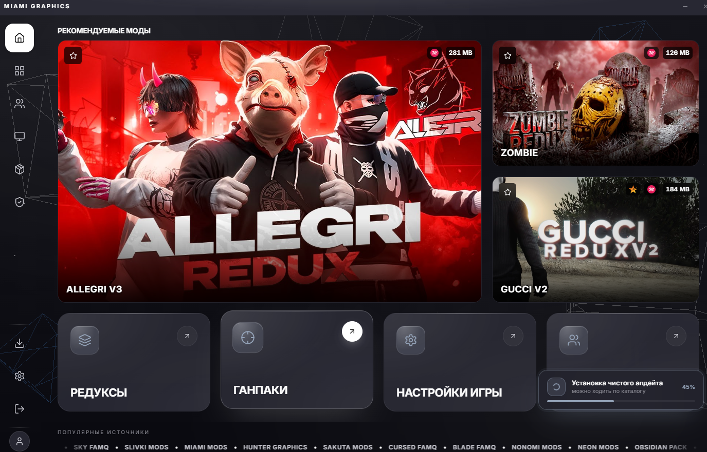
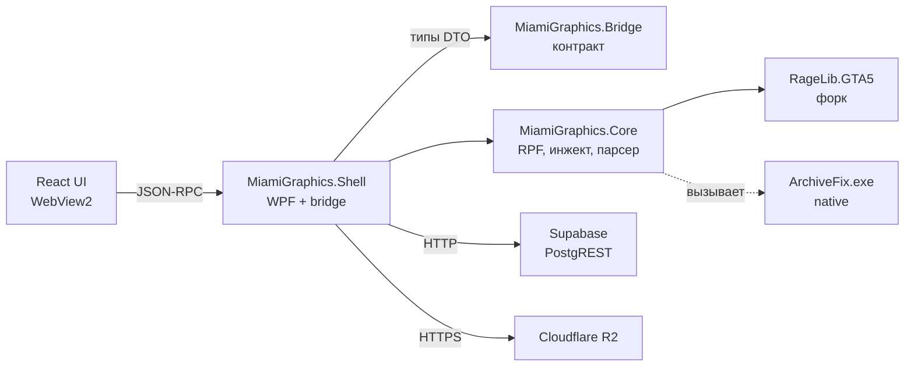

# Что такое Miami Graphics

Лаунчер для GTA V в RP-режиме (GTA5RP, Majestic и подобные сервера). Не клиент игры - игру юзер запускает сам через Rockstar Launcher. Мы - слой между его установленной GTA и каталогом модов: визуальные пресеты (`redux`), оружейные паки (`gunpack`), бронежилеты, минимапы, прицелы, трейсера, кастомные звуки.

## Чем занимается

1. Хранит каталог модов в Supabase, отдаёт превью и тяжёлые файлы с Cloudflare R2.
2. Скачивает у юзера сам мод (зашифрованный архив или наш собственный «дифф-пакет»).
3. Безопасно подменяет содержимое `update.rpf` в его установке GTA так, чтобы игра не упала на запуске.
4. Хранит чистую копию `update.rpf` для отката.
5. Даёт админу залить новый мод через WPF-интерфейс прямо в каталог: парсит, генерирует превью, рендерит 3D-модели в PNG, загружает в R2, регистрирует в БД.

## Из чего состоит код

Четыре проекта на C# плюс веб-фронт.

`MiamiGraphics.Core` ничего не знает о UI и Supabase. Это чистая домен-библиотека: открой RPF, посчитай diff, инжектни. Тестируется отдельно.

`MiamiGraphics.Bridge` - только DTO. Сюда складываются типы которые ходят между C# и React (через JSON). Цель - не дать UI узнать про реализацию, и не дать домену знать про сериализацию.

`MiamiGraphics.Shell` - оркестратор. WPF host для WebView2, AppBridge с двумя сотнями handler'ов которые подключают UI к Core и к Supabase. Все «сервисы» которые делают сетевые штуки (DPI-обход, кеш ассетов, DoH) живут тут.

`ui/` внутри Shell - Vite + React 18 + Zustand-сторы + Three.js для 3D. Билд кладётся в `app/ui/`, WebView2 грузит `index.html` с локального диска.

## Что значит «безопасный инжект»

GTA загружает `update.rpf` при старте игры. Если файл криво пересобран - хеши не сошлись, encryption не та, lookup table в шапке битая, или внутренний `.rpf` (вложенный архив) сделан с другим Encryption-флагом - игра падает с ошибкой `files corrupted` ещё до главного меню. Это не баг лаунчера, это просто игра отвергает повреждённый ресурс.

Поэтому каждая модификация прогоняет через:

1. **Хеш-проверка** - что у юзера сейчас лежит? Совпадает с чистой версией от Rockstar? Или это уже модифицированный (нашим или чужим лаунчером)? Или повреждённый?
2. **Восстановление чистой версии** - если нужно. Из локального кеша или с CDN.
3. **Smart Rebuild** - открываем чистый архив, проходим по дереву файлов, копируем неизменные, заменяем модифицированные, обрабатываем вложенные `.rpf` рекурсивно. Записываем атомарно через временный файл.
4. **ArchiveFix.exe** - внешний нативный инструмент пересчитывает CRC и checksum полей в шапке. Без него GTA отбросит файл даже если контент валидный.

Полная цепочка занимает 4-6 секунд на современном диске. До оптимизации это было [4 минуты на первой версии](history/ragelib-v2.md).

## Что хранится где

| Что | Где | Зачем |
|---|---|---|
| Метаданные каталога модов | Supabase: `redux_items`, `gunpacks`, `armor_library`, ... | Поиск, сортировка, фильтры |
| Версии модов (slot 1/2/3) | `redux_versions`, `armor_library_versions` | Один мод с несколькими ревизиями |
| Бинарные файлы модов (`patch.zip`, `dlc.rpf`, `armor.glb`) | R2: `redux/<id>/v<slot>/`, `gunpacks/<id>/`, `armor_library/<slug>/` | Тяжёлые ассеты, дешёвый egress |
| Превью PNG | R2: `redux/<id>/preview.png`, `gunpacks/<id>/guns/<name>.webp` | Грид карточек |
| 3D модели `.glb` | R2: `gunpacks/<id>/guns/<name>.glb`, `armor_library/<slug>/armor.glb` | Viewer в UI |
| Чистый `update.rpf` юзера | Локально: `%LocalAppData%\MiamiGraphics\backup\clean\` | Для отката после установки мода |
| Снимок «грязного» `update.rpf` | Локально: `backup\snapshot\` | Первая установка после ручных правок - сохранили оригинал юзера |
| Текущая версия лаунчера | `config/installed_version.txt` + csproj reflection | Для AppUpdateCheck |
| Манифест бэкапа | `backup\manifest.json` | Какой файл к какой версии GTA относится |

[Дальше: почему это не «скачать и заменить» →](00-why-not-trivial.md)
