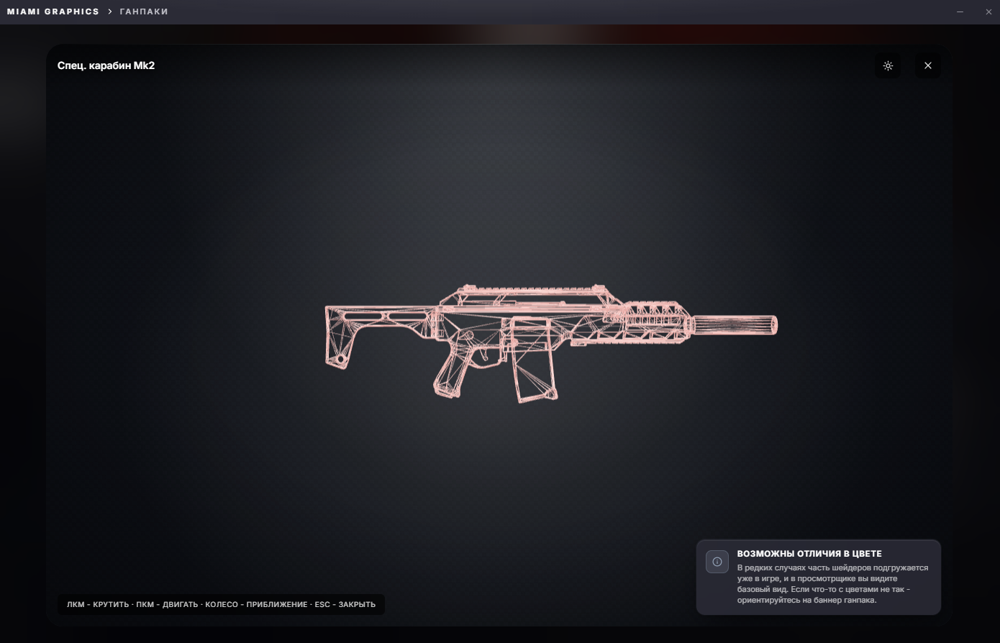

# GLB viewer в UI



Когда юзер открывает карточку оружейного пака или бронежилета - в UI крутится 3D-модель. Это React Three Fiber (R3F) + Three.js GLTFLoader. Файлы `.glb` мы хостим на R2, грузим напрямую в браузер WebView2.

## Зачем `.glb` а не оригинальные `.ydr`

Это история. Изначально пробовали показывать **прямо GTA-форматы**:

### Попытка 1: парсер `.ydr` на C# в Three.js

`.ydr` это RSC7-ресурс модели. Внутри сложная структура - drawable, models, geometries, materials, skeleton. У CodeWalker есть полный read-only парсер на C#.

План был: парсим `.ydr` через RageLib → переводим в Three.js-friendly формат (vertices/normals/uv/indices buffer) → отдаём в Canvas через postMessage.

Что пошло не так:

- **Текстуры**. `.ydr` ссылается на текстуры по имени, текстуры лежат в `.ytd` (отдельный resource). Чтобы получить bitmap, надо распаковать `.ytd`, найти текстуру по имени, конвертировать из RAGE-формата (DXT5 / BC7 / cubemap) в PNG. Это много работы для **просто превью** 3D модели.
- **Шейдеры**. У `.ydr` modeloв material это не «diffuse + normal + specular», а **shader тип** из 100+ предустановленных шейдеров RAGE (`gta_normal_spec_reflect`, `gta_alpha_water`, etc). Каждому соответствует свой набор textures и параметров. Three.js не понимает их, нужно мапить вручную.
- **Скелет и анимации**. У оружий нет анимаций обычно, но у персонажных моделей есть. Пришлось бы парсить bone hierarchy.
- **Размер кода**. Полная имплементация это **2-3 тысячи строк** C# и столько же JS. Один человек на это бы потратил недели.

После пары дней попыток с `.ydr` решил что это не приоритет - UX превью важнее, формат можно конвертировать заранее на admin-стороне.

### Попытка 2: glTF text format

Третий формат от Khronos - JSON + bin blob + текстуры PNG. Удобно для отладки (можно открыть в текстовом редакторе), но **много файлов** - отдельно `.gltf`, `.bin`, и каждая текстура `.png`. Для каталога из 200 ганов это 1000+ файлов в R2. Дорого по PUT/GET операциям.

Также Three.js GLTFLoader загружает текстуры **относительно** `.gltf` файла. Если хранить на R2 - придётся резолвить URLs руками.

Использовали короткое время для двух тестовых ганов. Не масштабируется.

### Попытка 3 (финальная): `.glb` binary glTF

`.glb` это **тот же** glTF, но всё (JSON + bin + textures) упаковано в **один** binary файл. Один файл на ган. На R2 это PUT раз, GET тоже раз. UI грузит одним `useGLTF(url)`.

Размер 300 КБ - 2 МБ на модель (зависит от количества polys и текстур). На UI рендерится моментально.

## Конверт `.ydr` → `.glb`

Делается **на admin-стороне** при заливке гана-пака. Парсер берёт `.ydr` + `.ytd`, через CodeWalker.Core читает геометрию, через ImageMagick конвертирует текстуры из BC7/DXT5 в PNG, склеивает glTF, упаковывает в `.glb`.

Это **тяжёлая** операция: 2-5 секунд на маленькую модель, до 30 секунд на сложную (например модель снайперки с детализированной нашивкой). Делается **один раз** при upload'е, кешируется в R2.

```cs title="MiamiGraphics.Core/Parser/ArmorGlbExporter.cs (упрощённо)"
public static bool TryExportArmorGlb(string workDir, IArchiveDirectory moddedRoot, ResolvedComponentMap componentMap)
{
    // 1. Найти armor .ydd модели в моде
    if (!componentMap.Components.TryGetValue("armor", out var info))
        return false;

    foreach (var path in info.InternalPaths.Where(p => p.EndsWith(".ydd")))
    {
        var yddFile = ResolveFromPath(moddedRoot, path);
        var yddBytes = yddFile.GetBytes();

        // 2. Найти соседний .ytd с текстурами
        var ytdPath = path.Replace(".ydd", ".ytd");
        var ytdBytes = ResolveFromPath(moddedRoot, ytdPath)?.GetBytes();

        // 3. Конвертация через CodeWalker.Core + glTF SDK
        var converter = new YddToGlbConverter(yddBytes, ytdBytes);
        var glb = converter.ConvertToGlb();

        File.WriteAllBytes(Path.Combine(workDir, "armor", "armor.glb"), glb);
    }
    return true;
}
```

`CodeWalker.Core` - это **только парсер**, без UI. У нас он подключен как ProjectReference. Используем для чтения геометрии и текстур, дальше всё кастомное.

## UI viewer

Три места где показываем 3D:

| Где | Что | Файл |
|---|---|---|
| Armor card (полный экран armor) | броник модель | `ArmorPreview3DCanvas.tsx` |
| Gunpack gun card | модель ствола | `GunPreview3DCanvas.tsx` |
| GLB viewer modal (по клику на превью) | full-screen с возможностью повернуть, zoom | `GlbViewerModalCanvas.tsx` |

```tsx title="MiamiGraphics.Shell/ui/src/screens/armor/ArmorPreview3DCanvas.tsx"
import { OrbitControls, Center, Bounds, useGLTF } from '@react-three/drei';
import { Canvas } from '@react-three/fiber';

function Model({ url }: { url: string }) {
    const { scene } = useGLTF(url);
    return <primitive object={scene} />;
}

export function ArmorPreview3DCanvas({ url }: { url: string }) {
    return (
        <Canvas camera={{ position: [0, 0, 3], fov: 35 }} dpr={[1, 2]}>
            <ambientLight intensity={0.6} />
            <directionalLight position={[5, 5, 5]} intensity={1.2} />
            <Bounds fit clip margin={1.2}>
                <Center>
                    <Model url={url} />
                </Center>
            </Bounds>
            <OrbitControls enableZoom enablePan={false} />
        </Canvas>
    );
}
```

`Bounds fit clip` - auto-scale модели чтобы влезла в viewport. `OrbitControls` - мышь для поворота, скролл для zoom. Без всего этого юзер видел бы 1000-метровую модель снаружи камеры или модель внутри камеры.

## DPR (DevicePixelRatio)

`dpr={[1, 2]}` - клампим pixel ratio между 1 и 2. На 4К-мониторах нативный DPR = 3-4, что значит canvas рендерится в 4× больше пикселей чем размер UI. Это **очень дорого** для GPU.

Кламп до 2 даёт нам:

- На обычных 1080p/1440p мониторах - DPR=1, рендер в native размер;
- На high-DPI 4K мониторах - DPR=2, рендер в 2× UI размер (читабельно но не overkill);
- Не выше 2 - экономия GPU.

## Cleanup при unmount

R3F кеширует GLTF загрузки глобально через `useGLTF`. Если просто удалить компонент из дерева, в кеше остаётся reference на материалы и геометрию - **GC не освободит память**, и через 20 модов памяти не останется.

```tsx
useEffect(() => {
    return () => {
        try { useGLTF.clear(url); } catch { /* */ }
    };
}, [url]);
```

Это «явно скажи кешу выкинуть этот URL». Three.js потом сделает GC на материалы.

## WebView2 specifics

WebView2 это Edge Chromium, поэтому WebGL2 работает из коробки. Производительность практически идентична нативному Chrome.

Единственный нюанс - мы грузим `.glb` с CDN, и для РФ юзеров путь идёт через [WebView2BypassInterceptor](../network/webview2-bypass.md). Без него native WebView2 fetch идёт через WinHTTP который **не** проходит наш FragmentingHttpHandler, и в РФ блоки Cloudflare режут запросы по SNI.

Interceptor хукает `WebResourceRequested` event, перенаправляет URL через C# HTTP clients (с TLS frag), отдаёт обратно body как `WebResourceResponse`. Для juiced WebGL загрузки это критично - без него 3D viewer падал с CORS errors у части юзеров.

[Дальше: headless рендер на сервере →](headless-render.md)
