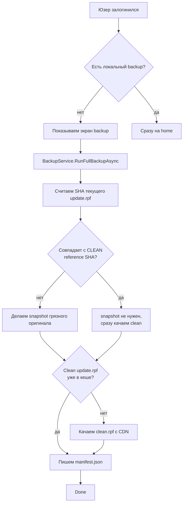

# Backup pipeline

Перед первым install мы делаем **полный backup** того что лежит у юзера в GTA - `update.rpf` и `update/x64/dlcpacks/patchday18ng/dlc.rpf`. Это критично - без чистой копии мы не сможем сделать [Smart Rebuild](../inject/smart-rebuild.md), потому что он работает только с чистой версией.

## Когда запускается



После этого install pipeline'ы могут идти.

## Пути хранения

```
%LocalAppData%\MiamiGraphics\backup\
├── manifest.json              ← какие файлы к какой версии GTA
├── clean\
│   ├── update_1.0.3788.0.rpf  ← чистая копия от Rockstar (с CDN)
│   └── dlc_1.0.3788.0.rpf
└── snapshot\
    └── update_1.0.3788.0_20260519_142345.rpf   ← оригинал юзера до того как мы влезли
```

## Manifest.json

```json title="backup/manifest.json"
{
  "ExeVersion": "1.0.3788.0",
  "LastBackupAt": "2026-05-19T14:23:45Z",
  "Files": {
    "CleanUpdate":  { "Path": "clean/update_1.0.3788.0.rpf",            "Size": 2010816512, "Sha256": "f3a8..." },
    "CleanDlc":     { "Path": "clean/dlc_1.0.3788.0.rpf",               "Size": 419430400 },
    "SnapshotUpdate": { "Path": "snapshot/update_1.0.3788.0_20260519_142345.rpf", "Size": 2014567384, "CreatedAt": "..." },
    "SnapshotDlc": null
  }
}
```

- **CleanUpdate** - чистая reference копия. Используется для Smart Rebuild и для restore-clean.
- **SnapshotUpdate** - оригинал юзера до первого install. Используется если юзер захотел «верни всё как было».
- **SnapshotDlc** - то же для DLC.

## Источники clean

Три варианта откуда брать чистый `update.rpf`:

### Источник 1: сам юзер (если SHA совпал)

Самый частый и быстрый. Если SHA текущего файла совпадает с reference из `gta_versions` - мы **копируем** его прямо к нам:

```cs title="MiamiGraphics.Core/System/BackupService.cs"
if (!isDirty)
{
    if (!File.Exists(cleanUpdateAbs))
    {
        await CopyFileAsync(workingUpdate, cleanUpdateAbs, ...);
        cleanUpdateAvailable = true;
    }
}
```

Никакой сети, никаких CDN - просто `File.Copy` (с прогрессом). На NVMe 2 ГБ за 4-8 секунд.

### Источник 2: R2 CDN

Если SHA не совпал (юзер до нас уже играл с модами) - качаем reference копию из нашего R2:

```
https://cdn.miamigraphicsstorage.uk/gta_versions/1.0.3788.0/clean_update.rpf
```

Этот файл админ загружает один раз при выходе нового патча GTA. Он лежит в bucket'е, public-read.

```cs title="MiamiGraphics.Core/System/R2BackupSource.cs"
public async Task<Stream> OpenCleanUpdateAsync(string exeVersion, CancellationToken ct)
{
    var url = $"{_baseUrl}/gta_versions/{exeVersion}/clean_update.rpf";
    var resp = await _http.GetAsync(url, HttpCompletionOption.ResponseHeadersRead, ct);
    resp.EnsureSuccessStatusCode();
    return await resp.Content.ReadAsStreamAsync(ct);
}
```

Download через [FragmentingHttpHandler](../network/fragmenting-http-handler.md) для DPI bypass в РФ. Скорость 5-15 МБ/с типично, 2 ГБ файл качается 2-5 минут.

### Источник 3: локальный folder (для админа)

Когда лаунчер запускает админ который сам делает релизы - нет смысла качать `clean_update.rpf` с CDN, он лежит у него на диске. Лаунчер ищет `additionals/clean_update.rpf` рядом с собой:

```cs title="MiamiGraphics.Core/System/LocalFolderBackupSource.cs"
public async Task<Stream> OpenCleanUpdateAsync(string exeVersion, CancellationToken ct)
{
    var path = Path.Combine(_folderPath, "clean_update.rpf");
    if (!File.Exists(path)) throw new FileNotFoundException(...);
    return File.OpenRead(path);
}
```

Это **dev-only** путь. У обычных юзеров `LocalFolderBackupSource` не используется - только R2.

## Snapshot грязного

Если юзер пришёл к нам **с уже модифицированным** `update.rpf` (играл раньше через другой launcher или вручную) - мы **сохраняем** его оригинал в `snapshot/`:

```cs title="MiamiGraphics.Core/System/BackupService.cs"
if (isDirty && manifestSnapshot is null)
{
    var ts = DateTime.UtcNow.ToString("yyyyMMdd_HHmmss");
    snapshotUpdatePath = Path.Combine("snapshot", $"update_{exeVersion}_{ts}.rpf");
    await CopyFileAsync(workingUpdate, Path.Combine(_backupRoot, snapshotUpdatePath), ...);
}
```

Это нужно потому что мы дальше **затрём** этот файл нашими install'ами. Если юзер захочет «откатиться к тому что было до Miami Graphics» - у нас есть оригинал. UI имеет кнопку «Восстановить snapshot» в Settings.

`manifestSnapshot is null` - снимок делаем **один раз**. Если у юзера уже есть snapshot в manifest, не перезаписываем (его и так держим). Это защита от потери оригинала при повторных backup'ах (например юзер кликнул «Reset cache», прошёл backup заново - мы не хотим записать поверх его оригинала наш-install'ный файл как snapshot).

## RetryOnSharingViolationAsync

Главный enemy backup'а - `IOException: Sharing violation`. `update.rpf` могут держать:

- Сама GTA (если запущена);
- Rockstar Launcher (после crash'а или при auto-update);
- Антивирус (сканит файл при изменении);
- Windows Search Indexer (если в `<gta>/` включена индексация);
- OneDrive / Dropbox если они syn'ят GTA-папку (странно, но бывает).

Мы делаем retry с backoff:

```cs title="MiamiGraphics.Core/System/BackupService.cs"
await RetryOnSharingViolationAsync(
    () => CopyFileAsync(workingUpdate, cleanUpdateAbs, ...),
    ct);
```

3 попытки с интервалами 500ms, 1000ms, 2000ms. Если на 4-ю попытку всё ещё `Sharing violation` - мы [определяем кто держит](#filelockdetector) через Restart Manager API, показываем юзеру список процессов и просим закрыть.

## FileLockDetector

Когда `IOException` мы можем **точно** сказать какие процессы держат файл:

```cs title="MiamiGraphics.Core/System/FileLockDetector.cs"
public static IReadOnlyList<LockerProcess> WhoIsLocking(string path)
{
    // Использует Windows Restart Manager API:
    // RmStartSession, RmRegisterResources, RmGetList, RmEndSession
    // Возвращает список { ProcessName, Pid }
}
```

UI потом показывает modal:

> Файл update.rpf занят. Закрой эти программы:
> - GTA5.exe (PID 12345)
> - PlayGTAV.exe (PID 67890)
>
> [Закрыть программы и попробовать снова] [Отмена]

Кнопка «Закрыть программы» вызывает `KillProcessesByPid` через bridge - мы реально kill'нем их Process.Kill. Это работает только для пользовательских процессов (не для system services).

## Atomic write манифеста

Manifest.json пишется через temp + rename pattern:

```cs title="MiamiGraphics.Core/System/BackupService.cs"
private void WriteManifest(Manifest m)
{
    var json = JsonSerializer.Serialize(m, ManifestJson);
    var tmp = _manifestPath + ".tmp";
    File.WriteAllText(tmp, json);
    File.Move(tmp, _manifestPath, overwrite: true);
}
```

`File.Move` на NTFS на одном томе - atomic. Это значит manifest либо целиком старая версия, либо целиком новая. Power-loss посередине не даст 0-byte манифест.

Атомарных операций три по pipeline'у - manifest.json, clean.rpf (через CopyFileAsync), snapshot.rpf. Все через temp+rename.

[Дальше: atomic writes →](atomic-writes.md)
