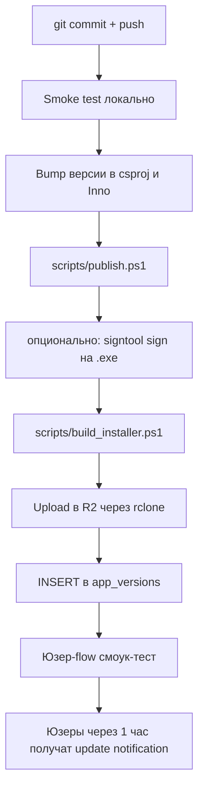

# Релиз pipeline

End-to-end процесс выкатки новой версии Miami Graphics. От `git commit` до того момента, когда юзеры получают auto-update notification.

## Шаги в нормальном порядке



## Полный скрипт

```powershell title="scripts/release.ps1"
param(
    [Parameter(Mandatory)] [string]$Version,
    [string]$ReleaseNotes = "Bug fixes and improvements",
    [switch]$DryRun
)

$ErrorActionPreference = "Stop"

Write-Host "=== Releasing Miami Graphics $Version ===" -ForegroundColor Cyan

# 1. Build
.\scripts\publish.ps1 -Version $Version
.\scripts\build_installer.ps1 -Version $Version

$installerExe = "installer/output/MiamiGraphicsSetup_$Version.exe"
if (-not (Test-Path $installerExe)) { throw "Installer не собрался" }

if ($DryRun) {
    Write-Host "DryRun - выйдем тут. Installer: $installerExe"
    return
}

# 2. Upload в R2
$r2Path = "r2:huntergraphics/releases/MiamiGraphicsSetup_$Version.exe"
rclone copy $installerExe r2:huntergraphics/releases/
Write-Host "Uploaded to $r2Path"

# 3. INSERT в Supabase
$supabaseUrl = $env:SUPABASE_URL
$serviceKey  = $env:SUPABASE_SERVICE_KEY
$installerUrl = "https://cdn.miamigraphicsstorage.uk/releases/MiamiGraphicsSetup_$Version.exe"

# Сбрасываем is_latest у всех старых
Invoke-RestMethod -Method Patch `
    -Uri "$supabaseUrl/rest/v1/app_versions?is_latest=eq.true" `
    -Headers @{ "apikey" = $serviceKey; "Authorization" = "Bearer $serviceKey"; "Content-Type" = "application/json" } `
    -Body '{"is_latest": false}'

# Ставим новый
Invoke-RestMethod -Method Post `
    -Uri "$supabaseUrl/rest/v1/app_versions" `
    -Headers @{ "apikey" = $serviceKey; "Authorization" = "Bearer $serviceKey"; "Content-Type" = "application/json" } `
    -Body (@{
        version = $Version
        installer_url = $installerUrl
        release_notes = $ReleaseNotes
        is_latest = $true
    } | ConvertTo-Json)

Write-Host "Supabase app_versions updated to $Version" -ForegroundColor Green
Write-Host "Юзеры получат update notification при следующем запуске лаунчера"
```

## Smoke-tests перед release'ом

Прогоняем вручную:

- [x] `npm run build` без warning'ов.
- [x] `dotnet publish` без warning'ов.
- [x] Запуск .exe из publish - лаунчер открывается, UI грузится.
- [x] Login flow работает.
- [x] Open Browse → видим redux'ы (Supabase connection ok).
- [x] Open one redux → preview грузится (R2 connection ok).
- [x] Install какого-нибудь test-redux'а на тестовый GTA → success.
- [x] Запуск GTA → визуально применилось.
- [x] Restore Clean → откатилось.
- [x] Settings → Test bypass → проходит.

Если что-то падает - НЕ release'им, фиксим, начинаем сначала.

## Code signing (TODO)

Сейчас наш .exe **не подписан** - Windows показывает SmartScreen warning «Unknown publisher» при первом запуске. Юзеры жмут «More info → Run anyway».

В roadmap'е - Authenticode сертификат от DigiCert/Sectigo (~$200/год standard, $400/год EV). EV убирает SmartScreen warning **сразу**, standard - после ~3 месяцев reputation building.

Не сделали пока потому что:
- $200-400/год - реальный money cost для solo-dev project'а.
- SmartScreen warning ловят 99% юзеров «running anyway» - не блокер.
- Russian users не верят EV signs всё равно (TLS-frag не вяжется с «trusted publisher» concept).

## Rollback процедура

Если после release обнаружили critical bug:

1. В Supabase ставим `is_latest = false` для проблемной версии:
   ```sql
   update app_versions set is_latest = false where version = '1.0.2';
   update app_versions set is_latest = true  where version = '1.0.1';
   ```
2. Старая версия (`1.0.1`) снова becomes «latest».
3. Юзеры на `1.0.2` НЕ откатываются автоматически (auto-update только forward). Но новые юзеры качают `1.0.1`.
4. Фиксим bug, выкатываем `1.0.3`. Юзеры с `1.0.2` обновятся в `1.0.3` напрямую.

R2 файл `1.0.2.exe` **оставляем** на R2 - на случай дебага потом.

## Версионирование

Major.Minor.Patch (SemVer-ish):

- **Major** (`2.0.0`) - breaking changes в data model или workflow. **Никогда не делали**.
- **Minor** (`1.1.0`) - новые features (новый component type, новая admin-секция).
- **Patch** (`1.0.X`) - bug fixes, мелкие UI improvements.

Сейчас на 1.0.X - мы в active development, не bumped в 1.1 ещё.

## CI/CD (TODO)

Сейчас release полностью **manual** - выполняется с машины владельца по шагам,
руками. Это работает на маленькой команде (1 dev), но плохо scale'ится.

!!! warning "Скриптов `release.ps1` и `release-velopack.ps1` больше нет"
    Они удалены 14.08.2026 как мёртвые: оба делали `Push-Location
    "HunterGraphics.Shell\ui"`, а проект переименован в `MiamiGraphics`, так что
    падали на первом шаге. Velopack к тому же отказались ещё раньше - обёртка
    ловила false positive на VirusTotal. Актуальный порядок другой: собрать
    интерфейс, `dotnet publish` папкой, `scripts/zip-payload.cjs`,
    `scripts/upload-payload.mjs`, стейдж на ru1, вписать URL payload'а в
    `MiamiGraphics.Installer/Services/InstallPipeline.cs`, собрать stub,
    `scripts/upload-stub.mjs`, миграция. Блок YAML ниже - ЗАМЫСЕЛ, а не
    работающий пайплайн: `scripts/publish.ps1` и `scripts/build_installer.ps1`
    в репозитории не существуют, а единственный живой воркфлоу -
    `.github/workflows/docs.yml`, и он публикует документацию. Проверки типов
    не делает ничто, кроме человека, который запускает `npm run build`.

В roadmap'е - GitHub Actions:

```yaml title="хочется .github/workflows/release.yml"
name: Release
on:
  push:
    tags: ['v*']
jobs:
  build:
    runs-on: windows-latest
    steps:
      - uses: actions/checkout@v4
      - uses: actions/setup-dotnet@v4
      - uses: actions/setup-node@v4
      - name: Build UI
        run: cd MiamiGraphics.Shell/ui && npm ci && npm run build
      - name: Publish
        run: ./scripts/publish.ps1 -Version ${{ github.ref_name }}
      - name: Build Installer
        run: ./scripts/build_installer.ps1 -Version ${{ github.ref_name }}
      - name: Upload to R2
        env:
          AWS_ACCESS_KEY_ID: ${{ secrets.R2_KEY }}
          AWS_SECRET_ACCESS_KEY: ${{ secrets.R2_SECRET }}
        run: aws s3 cp installer/output/*.exe s3://huntergraphics/releases/ --endpoint-url=https://<id>.r2.cloudflarestorage.com
      - name: Update Supabase
        env:
          SUPABASE_URL: ${{ secrets.SUPABASE_URL }}
          SUPABASE_KEY: ${{ secrets.SUPABASE_SERVICE_KEY }}
        run: pwsh ./scripts/update_supabase_version.ps1 -Version ${{ github.ref_name }}
```

Это автоматизирует release полностью - `git tag v1.0.3 && git push --tags` и через 10 минут юзеры получают update. Не сделали пока потому что local release работает, secrets management в GitHub Actions - отдельная задача.

[Дальше: Changelog →](../changelog.md)
