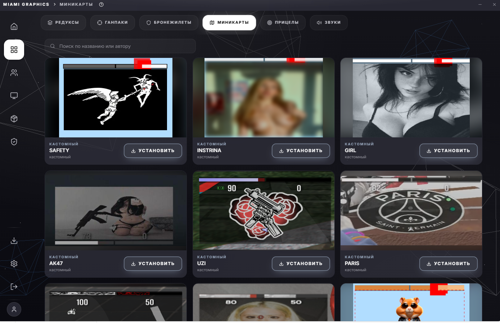
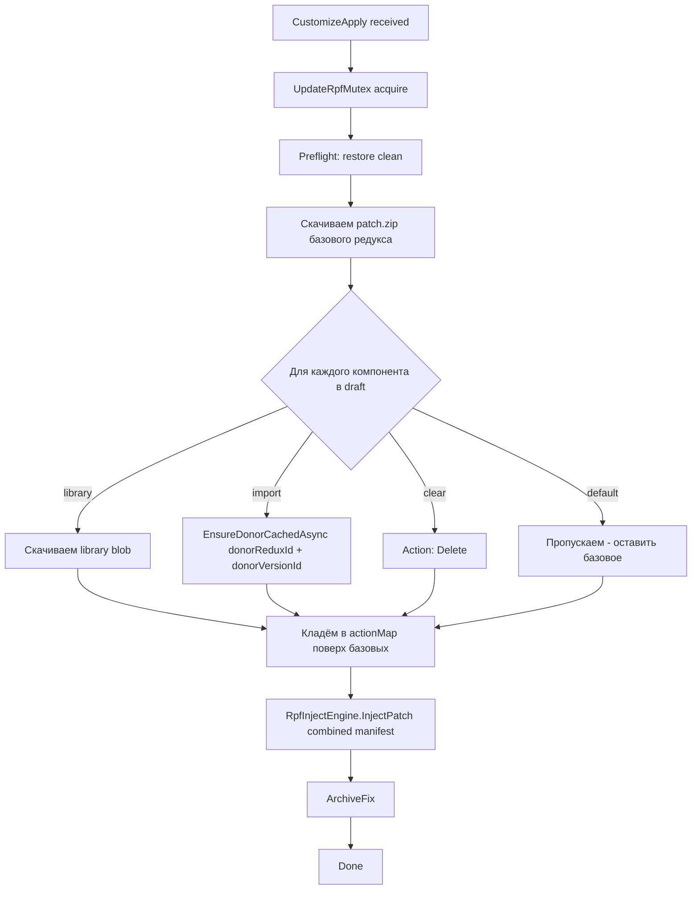

# Customize data model



Customize - фича где юзер собирает «свой» редукс из частей разных авторских модов. Берёт визуальную основу одного, минимапу из другого, прицел из третьего, трейсера из четвёртого.

## Из чего состоит draft

`CustomizationDraft` это **временный** объект который юзер собирает в UI:

```ts title="MiamiGraphics.Shell/ui/src/store/customizeStore.ts"
export interface CustomizationDraft {
    reduxId:        string;          // базовый редукс
    baseVersionId?: string;          // выбранная версия базового (multi-version)
    bloodfx:        GenericSetting;
    crosshair:      GenericSetting;
    timecycle:      GenericSetting;
    armor:          GenericSetting;
    arena:          GenericSetting;
    minimap:        MinimapSetting;
    tracers:        TracerSetting;
}

export type GenericSetting =
    | { kind: 'default' }                          // оставить как в базовом редуксе
    | { kind: 'library'; libraryItemId: string; ... }  // взять из нашей библиотеки
    | { kind: 'import';                             // импортировать из другого редукса
          donorReduxId: string;
          donorReduxName: string;
          donorVersionId: string | null;
          donorVersionLabel: string | null;
      }
    | { kind: 'clear' };                            // удалить компонент полностью
```

Семь компонентов, семь полей в draft. Для каждого - четыре варианта источника:

| Kind | Что значит |
|---|---|
| `default` | Не трогать. Установка пройдёт с компонентом из базового редукса. |
| `library` | Взять отдельный компонент из нашей библиотеки (cм. Library). |
| `import` | Скачать **только этот компонент** из другого редукса. |
| `clear` | Удалить компонент полностью. Vanilla версия от Rockstar остаётся. |

## Multi-version: `donorVersionId`

Многие redux'ы имеют несколько версий: Gucci V1, V2, V3. Каждая версия - отдельный set файлов в БД (table `redux_versions`).

Когда юзер выбирает «броник из Gucci» - мы должны знать **из какой версии**. У V1 может быть один броник, у V3 - другой.

Раньше [была проблема](../history/codewalker.md) - version не передавалась, бэкенд брал slot 1 по умолчанию. Если у V1 нет armor компонента (он появился только в V2) - install молча падал.

Сейчас `import` setting **обязательно** содержит:

```ts
{
    kind: 'import',
    donorReduxId: 'gucci',
    donorVersionId: 'abc-uuid-v2',   // конкретный version row
    donorVersionLabel: 'V2',          // для UI
    donorReduxName: 'Gucci'
}
```

UI картирует это через `ImportReduxPreview`:

1. Юзер кликает на donor card в picker'е (Gucci).
2. Открывается preview с **picker'ом версий** - все эли версии Gucci где есть выбранный компонент.
3. Юзер выбирает V2, кликает Save.
4. Draft записывает `donorVersionId = V2.id`.

## Особый MinimapSetting

Минимапа не `GenericSetting` потому что у неё есть **доп-параметры**: цвет HP-бара, цвет armor-бара, aspect ratio, position.

```ts
export interface MinimapSetting {
    enabled: boolean;
    hpColor: string;             // hex '#ff0000'
    armorColor: string;
    aspectRatio: MinimapAspectRatio;     // '16:9' | '21:9' | 'square'
    position: MinimapPosition;            // 'bottom-left' | ...
    pngOverlayPath: string | null;       // загруженная юзером картинка-наложение
    importedFrom: {                      // если import-mode
        reduxId: string;
        reduxName: string;
        versionId: string | null;
        versionLabel: string | null;
    } | null;
    librarySource: { libraryItemId: string; libraryItemName: string } | null;
}
```

`hpColor` и `armorColor` редактируются прямо в UI (color picker). Backend [конвертирует их в SWF-формат](minimap-history.md) через swfmill + ffdec.

## Особый TracerSetting

Трейсера тоже не `GenericSetting` - у них **RGB**:

```ts
export interface TracerSetting {
    source:
        | { kind: 'default' }
        | { kind: 'model'; modelId: string }   // выбранный из preset-модельов
        | { kind: 'import'; donorReduxId: ...; donorVersionId: ... };
    rgb: { r: number; g: number; b: number };   // 0-255
}
```

`model` - это **готовые модельки** трейсеров которые мы добавили (Uzi, Plasma, Чёткие, Dissolving, etc) - это PRE-rendered `.ypt` файлы которые лежат в `additionals/tracers/<modelId>/core.ypt`. Юзер выбирает один из них, RGB меняет цвет.

`import` - взять `core.ypt` из чужого редукса. Уже [обсуждалось](../parser/what-we-extract.md) - это **полная замена** всего `core.ypt`, потому что менять отдельные партиклы внутри невозможно.

## Apply pipeline

Когда юзер жмёт «Применить кастомизацию», `customizeStore.apply()` собирает draft в bridge wire format:

```ts title="customizeStore.ts (упрощённо)"
const wire: CustomizationDraftBridge = {
    reduxId:        draft.reduxId,
    baseVersionId:  draft.baseVersionId,
    bloodfx:        flatGeneric(draft.bloodfx),
    crosshair:      flatGeneric(draft.crosshair),
    timecycle:      flatGeneric(draft.timecycle),
    armor:          flatGeneric(draft.armor),
    arena:          flatGeneric(draft.arena),
    minimap: {
        enabled, hpColor, armorColor, aspectRatio, position, pngOverlayPath,
        importedFromReduxId: draft.minimap.importedFrom?.reduxId ?? null,
        donorVersionId:      draft.minimap.importedFrom?.versionId ?? null,
        libraryItemId:       draft.minimap.librarySource?.libraryItemId ?? null,
    },
    tracers: flatTracers(draft.tracers),
};

await bridge.reduxCustomizeApply(draft.reduxId, wire);
```

Дальше C# `ReduxCustomizeApplyAsync`:



Главная штука - мы **сначала** строим финальный actionMap (объединяя actions из base + import donors + library), **потом** один Smart Rebuild с объединённым набором. Никаких промежуточных установок и откатов.

## EnsureDonorCachedAsync

Для `import`-компонента нам надо качать **только нужный компонент** из donor'а, не весь patch.zip. Здесь и пригождается `componentUrls` из БД ([см. component-detection](../parser/component-detection.md)):

```cs title="MiamiGraphics.Shell/Bridge/AppBridge.cs"
private async Task<string> EnsureDonorCachedAsync(
    string donorReduxId,
    string componentType,        // 'minimap' / 'crosshair' / 'tracers' / 'armor'
    HttpClient http,
    Action<string, int>? emit,
    Guid? donorVersionId)
{
    var resolved = await ResolveVersionAsync(donorReduxId, donorVersionId);
    var url = resolved.Urls.Components[componentType];   // только нужный URL
    var cacheKey = $"{donorReduxId}_{donorVersionId ?? Guid.Empty}_{componentType}";
    var cachePath = Path.Combine(_donorCacheDir, cacheKey + ".bin");

    if (!File.Exists(cachePath))
    {
        // качаем через ParallelDownloader через FragmentingHttpHandler
        await DownloadFileAsync(http, url, cachePath, bytesProgress: ..., ct);
    }

    return cachePath;
}
```

Donor-cache живёт в `%LocalAppData%\MiamiGraphics\cache\donors\`. Если юзер активно делает customize (берёт minimap из X, потом snova меняет на Y, потом возвращается на X) - мы качаем X один раз.

## Donor patch без version: legacy слот

Если donor - старый редукс без отдельных версий (загружен до multi-version фичи), у него `versions = []`, а компоненты лежат на base-level: `redux_items.componentUrls`. ResolveVersionAsync это понимает:

```cs
if (resolved is null && donorReduxId != null)
{
    // legacy fallback - берём из redux_items
    var item = await _catalog.GetByIdAsync(donorReduxId);
    if (item?.R2Urls?.Components?.TryGetValue(componentType, out var url) == true)
        return new ResolvedVersion { Urls = { Components = { [componentType] = url } } };
}
```

Это backward-compat для редаксов которые были в каталоге до multi-version. Они работают как раньше, customize ничего не ломает.

[Дальше: история с минимапой и .gfx →](minimap-history.md)
