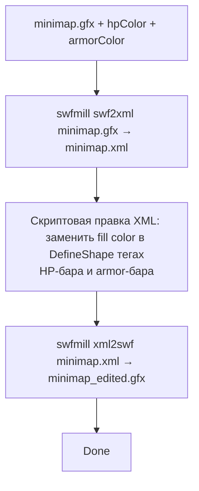

# История с минимапой и `.gfx`

Минимапа в GTA V это **векторная Flash-графика**. Конкретно - файл `minimap.gfx` в формате **Scaleform GFx** (это Adobe Flash с Scaleform-расширениями, отдельная binary спецификация).

Когда юзер хочет «такая же минимапа, но с красным HP-баром» - мы должны **редактировать** этот GFx файл. И тут началась история.

## План А - С# парсер GFx

Идея: разобрать `.gfx` как Flash binary, найти спрайт HP-бара, поменять fill color, упаковать обратно.

Первый день - посмотрел спецификацию SWF/GFx. Это **бинарный формат с tag-based** структурой: каждый объект (Sprite, Shape, Bitmap, Sound) - отдельный tag с typed payload. Около 60 типов тегов, плюс GFx-расширения от Scaleform.

Открытых С# библиотек для GFx-write **не** существует. Read-only есть пара - `swfdotnet`, `SwfMillTools`, - но ни одна не умеет mutate-and-write обратно валидный GFx.

Прикинул сколько строк своего парсера это будет: 60 тегов × ~50 строк = 3000+ строк. Плюс GFx-теги. Плюс сериализация. Плюс binary-stream reader. Около 5000 строк до первого рабочего «менять color».

Не разумно. Отбросил.

## План Б - внешний CLI

Существуют **готовые** open-source инструменты для работы с `.gfx`:

| Инструмент | Что умеет |
|---|---|
| **JPEXS Free Flash Decompiler (FFDec)** | Полный SWF/GFx editor - открытие, view, export ActionScript, replace bitmap, save обратно. Java, GUI или CLI. |
| **swfmill** | Конвертация SWF ↔ XML. Можно экспортировать в XML, отредактировать руками, импортировать обратно. Native C++ CLI. |
| **gfxExport** | Только export bitmap'ов из GFx. Не наша задача. |

JPEXS + swfmill вместе покрывают наши нужды. **Java** (для JPEXS) и **swfmill.exe** (native binary) поставляются с лаунчером в `additionals/`.

## Pipeline для «поменять HP color»



`swfmill swf2xml` распаковывает binary в XML. XML это плоский tree: `<swf>`, `<DefineSprite>`, `<DefineShape>`, и так далее. Внутри `DefineShape` тегов HP-бара есть `<style><fill type="solid"><color value="#FF0000"/></fill></style>`. Мы знаем какие конкретно shape-id отвечают за HP/armor бары (выявили experimentально один раз, записали в код).

```cs title="MiamiGraphics.Core/Services/MinimapBuilderService.cs (упрощено)"
private void RecolorSwf(string xmlPath, string hpColor, string armorColor)
{
    var doc = XDocument.Load(xmlPath);

    // Конкретные shape ID - определены экспериментально
    const int HpBarShapeId = 142;
    const int ArmorBarShapeId = 156;

    foreach (var shape in doc.Descendants("DefineShape"))
    {
        var id = int.Parse(shape.Attribute("id")?.Value ?? "-1");
        var targetColor = id switch
        {
            HpBarShapeId => hpColor,
            ArmorBarShapeId => armorColor,
            _ => null,
        };
        if (targetColor == null) continue;

        foreach (var color in shape.Descendants("color"))
            color.Attribute("value")!.Value = targetColor;
    }

    doc.Save(xmlPath);
}
```

`swfmill xml2swf` обратно пакует. Получаем новый `minimap.gfx` с поменянными цветами. Этот `.gfx` идёт в наш [Smart Rebuild](../inject/smart-rebuild.md) как Replace action.

## Подмена sprite (например custom HUD)

Юзер может загрузить свой PNG чтобы наложить на минимапу. Например логотип сервера в углу. Это уже **не цвет** а **bitmap replacement**.

Для этого используем **JPEXS FFDec** в режиме «import script»:

```
java -jar ffdec.jar -importScript minimap.swf out.swf scripts_dir/
```

`scripts_dir/` содержит подготовленный ActionScript который при загрузке `.gfx` инжектирует наш PNG как новый bitmap. Сам PNG бинаром лежит рядом со скриптом.

Команда внутри `RecolorSwf`:

```cs title="MinimapBuilderService.cs"
RunProcess(javaExe, $"-jar \"{ffdecJar}\" -export script \"{exportScriptDir}\" \"{swfForFfdec}\"");
// ... отредактировали ActionScript для injection custom HUD ...
RunProcess(javaExe, $"-jar \"{ffdecJar}\" -importScript \"{swfForFfdec}\" \"{outSwf}\" \"{exportScriptDir}\"");
```

Это **сложно** и **медленно** (Java startup ~2 секунды + ffdec.jar load ~3 секунды + работа 5-10 секунд). На каждое применение кастомизации minimap pipeline крутится 15-30 секунд.

## Зависимости

| Tool | Где | Когда нужен |
|---|---|---|
| `ffdec.jar` (JPEXS) | `additionals/minimap/ffdec.jar` | При custom HUD overlay или recolor |
| `swfmill.exe` | `additionals/minimap/swfmill.exe` | Всегда при minimap recolor |
| JRE 8 | `additionals/jre/` (on-demand через JreBootstrapper) | Нужна для запуска ffdec.jar |

JRE не приходит с инсталлером - 100 МБ Java бесполезны для 95% юзеров которые никогда не трогают минимапу. Качаем on-demand:

```cs title="MiamiGraphics.Shell/Services/JreBootstrapper.cs"
public sealed class JreBootstrapper
{
    private const string JreZipUrl = "https://cdn.miamigraphicsstorage.uk/releases/MiamiGraphicsJre_1.0.0.zip";
    // ... как у RendererBootstrapper ...
}
```

UI триггерит install JRE при первом minimap customize.

## Альтернатива которую я не выбрал

Можно было использовать **готовые** preset-минимапы из библиотеки. То есть юзер не редактирует свой HP-бар, а **выбирает** из 5-10 готовых вариантов (Red HP, Blue HP, Yellow HP, ...). Эти варианты админ заранее рендерит, сохраняет как полные `.gfx` файлы в R2, юзер просто их подгружает.

Это **проще** и **быстрее** (Install pipeline без java/ffdec). Но **очень ограничено** - только 5-10 цветов, никаких custom HUD overlays.

Решил что customization-стоимости стоит. Юзер получает реальную свободу цвета (RGB picker, не preset), и за это платит 30 секунд install pipeline.

[Дальше: donor cache →](donor-cache.md)
