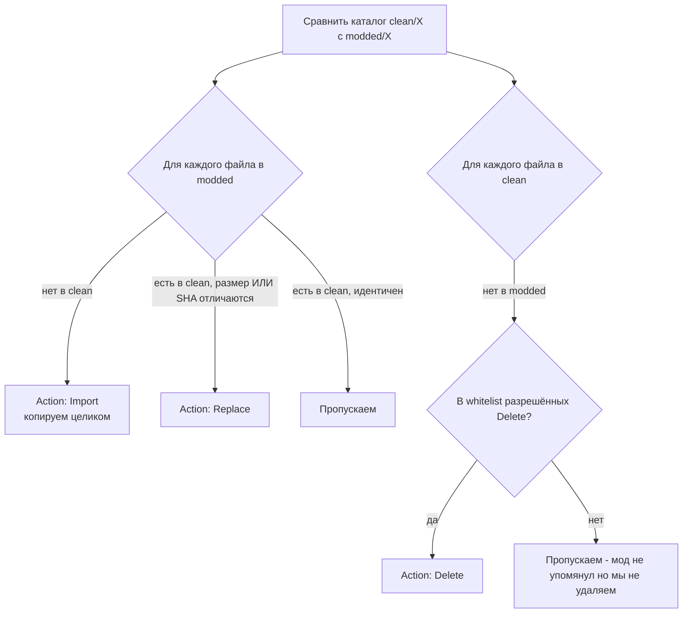

# Алгоритм diff

`RpfDiffEngine.CompareDirectories` - рекурсивный обход двух деревьев (чистый и модифицированный RPF) с генерацией списка [PatchAction](../parser/manifest-schema.md).

## Логика на одном уровне



«Whitelist разрешённых Delete» - это узкий список путей которые мы знаем что мод может убирать (например ванильные тонкие трейсера). Полная диагональ «всё что есть в clean и нет в modded» дала бы тысячи ложных Delete потому что моды не таскают с собой каждый файл ваниллы.

## Сравнение бинарного содержимого

Сначала **быстрый отказ** по размеру:

```cs title="RpfDiffEngine.cs (упрощённо)"
if (cleanFile.Size != moddedFile.Size)
{
    // 100% разные, добавляем Replace action
    AddReplace(moddedFile);
    continue;
}
```

Если размеры совпали - считаем **SHA-256** обоих файлов и сравниваем. Это дороже (читаем оба файла полностью), но размер не гарантия идентичности - два разных текста могут быть одной длины.

```cs
var cleanHash = ComputeSha256(cleanFile.Open());
var moddedHash = ComputeSha256(moddedFile.Open());
if (!cleanHash.Equals(moddedHash, StringComparison.OrdinalIgnoreCase))
{
    AddReplace(moddedFile);
}
```

## Особый случай: вложенные RPF

Когда обходим файлы и встречаем `.rpf` - нельзя просто посчитать SHA целого. Внутри могут быть **локальные** изменения.

Пример: `update.rpf:/x64/patch/data/cdimages/scaleform_minimap.rpf`. У чистой GTA и у мода этот вложенный rpf будет иметь **разный SHA** (потому что внутри `minimap.gfx` другой). Но это не значит что весь архив надо `Replace` - это значит надо **рекурсивно** сравнить его содержимое.

```cs
if (file.Name.EndsWith(".rpf", StringComparison.OrdinalIgnoreCase))
{
    // Рекурсивно сравниваем содержимое
    var cleanSubArc = RageArchiveWrapper7.Open(cleanFile.GetStream(), file.Name);
    var moddedSubArc = RageArchiveWrapper7.Open(moddedFile.GetStream(), file.Name);
    CompareDirectories(
        cleanSubArc.Root,
        moddedSubArc.Root,
        currentPath + file.Name.ToLower() + ":/",   // ":" для нашего path формата
        patchDir,
        actions);
    continue;  // не добавляем Replace на сам .rpf
}
```

В результате наши actions для модифицированной минимапы:

```
TargetPath: update/update.rpf:/x64/patch/data/cdimages/scaleform_minimap.rpf:/minimap.gfx
Type: Replace
```

То есть мы знаем что менять надо **только** `minimap.gfx` внутри вложенного архива, а не пересобирать весь `scaleform_minimap.rpf` целиком. Уже [Smart Rebuild](../inject/smart-rebuild.md) на стороне инжекта откроет родительский, увидит что внутри есть actions для вложенного, и рекурсивно пересоберёт **только** этот вложенный.

## Случай `IsWholeReplaceNestedRpf`

Иногда вложенный rpf настолько перелопачен в моде что выгоднее заменить его целиком чем делать вложенный diff. Например мод полностью переписал `dlc.rpf` своего собственного DLC. Тут разбиение на сотни мелких Replace не имеет смысла - внутри новый `.rpf` это просто новый бинарь.

Diff-engine эмпирически решает: если >70% файлов вложенного rpf отличаются - генерирует **один** Replace на сам вложенный:

```cs
if (cleanFiles.Count > 5 &&
    moddedFiles.Where(f => HasDiff(f, cleanFiles)).Count() / (float)cleanFiles.Count > 0.7f)
{
    AddReplaceWithFlag(file, IsWholeReplaceNestedRpf: true);
    return;  // не идём внутрь
}
```

Флаг `IsWholeReplaceNestedRpf` в action говорит инжектору: «не открывай этот rpf, просто замени бинаря-в-бинарь». Это экономит десятки секунд на парсинге огромных custom DLC.

## SourcePath - куда складываем файлы

Когда генерируется `Replace` или `Import`, нам надо **извлечь** модифицированный файл из donor RPF и положить в файл-систему чтобы потом упаковать в `patch.zip`. Это делает `ComponentExportService`:

```cs
var relPath = MakeRelativePath(action.TargetPath);  // "minimap.gfx"
var fullPath = Path.Combine(patchDirectory, relPath);
Directory.CreateDirectory(Path.GetDirectoryName(fullPath));

using (var fs = File.Create(fullPath))
    moddedFile.GetStream().CopyTo(fs);

action.SourcePath = relPath;
action.Size = new FileInfo(fullPath).Length;
action.Sha256 = ComputeSha256(fullPath);
```

`patchDirectory` это `Redux_<name>_<timestamp>/patch_files/`, в нём складываются все Replace+Import. Потом `Zip.CreateFromDirectory(patchDirectory, output: "patch.zip")` упаковывает целиком.

## Время работы

На NVMe + 1.5 ГБ donor RPF:

- Открытие архивов (clean + modded): ~200 мс;
- ContentXmlAnalyzer: ~50 мс;
- CompareDirectories рекурсивный: 2-6 секунд (зависит от количества вложенных RPF);
- ComponentScanner: ~300 мс;
- ArmorGlbExporter (если есть armor): 3-8 секунд (тяжёлая часть - конверт `.ydd` → `.glb`);
- Zip упаковка `patch.zip`: 1-3 секунды.

Total: 7-20 секунд на парс полного redux. Это admin-side, при заливке нового мода. Юзер этого не видит.

[Дальше: типы Action →](actions.md)
