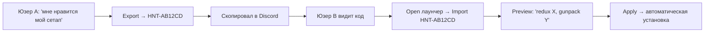
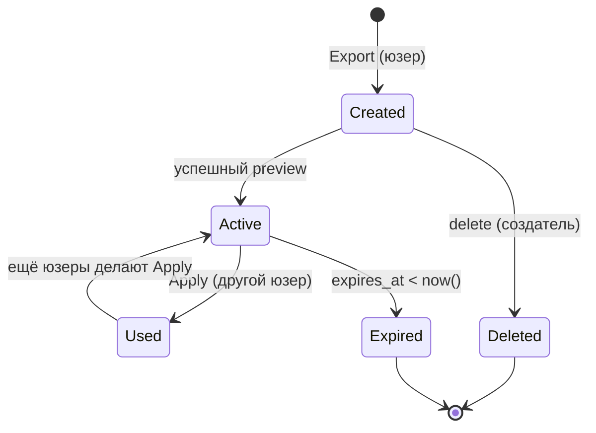

# HNT-коды


HNT-код это **короткая** строка типа `HNT-K7P2X9` которая представляет полный snapshot настроек юзера: какой redux установлен, какая версия, какой gunpack, какие отдельные пушки выбраны, кастомизация (если есть). Один code = воспроизводимая инсталляция.

## Зачем нужно

Юзер пишет в Discord «У меня офигенный сетап, накатил вот это и это». Раньше это было «пиши список модов в текст». Сейчас юзер делает Export → получает `HNT-AB12CD` → копирует в чат. Получатель открывает наш лаунчер, кликает Import → вводит код → одной кнопкой получает **тот же** сетап.

Это упрощает peer-to-peer обмен сборками. По сути «короткая ссылка на бэкап настроек».



## Структура таблицы

```sql
create table hnt_codes (
  code              text primary key,           -- "HNT-K7P2X9" (uppercase, 6 chars + prefix)
  payload           jsonb not null,             -- HntPayloadDto
  created_by        text,                       -- user_id создателя (NULL = public/proplayer)
  created_at        timestamptz default now(),
  last_downloaded_at timestamptz,
  downloads_count   int default 0,
  expires_at        timestamptz                 -- NULL = forever, иначе TTL
);
```

`created_by` отличает personal codes (юзер для себя) от public codes (от админа для pro-player'а или approved-билда). Personal коды могут быть удалены создателем; public - нельзя.

## Payload - что внутри

```cs title="MiamiGraphics.Core/Dto/HntPayloadDto.cs"
public sealed record HntPayloadDto(
    string?  ReduxId,         // какой redux установлен
    string?  ReduxVersionId,  // версия (для multi-version)
    string?  ReduxName,       // display name (для UI preview)
    string?  ReduxAuthor,
    string?  GunpackId,       // активный gunpack
    string?  GunpackName,
    List<HntSelectedGunDto>? SelectedGuns,    // whitelist отдельных пушек
    JsonElement? Extras       // customize draft если есть
);

public sealed record HntSelectedGunDto(
    string GunpackId,
    string GunpackName,
    string InternalName,    // WEAPON_PISTOL
    string DisplayName
);
```

Три **блока**, каждый optional:

1. **Redux** - какой графический пакет + версия. Может содержать `Extras.customizeDraft` если юзер сделал кастомизацию (minimap из X, tracers из Y).
2. **Gunpack** - какой gunpack установлен целиком.
3. **SelectedGuns** - список отдельных пушек из whitelist'а (см. админ-guns).

Юзер при экспорте может **выключить** любой блок (чекбоксы в UI), чтобы поделиться **только** redux'ом без своих пушек например.

## Жизненный цикл



Personal коды по дефолту без expiry - могут жить вечно. У public-кодов (proplayer/build) тоже без expiry.

Деактивация - это hard-delete row. Сделано через `HntCodeDeleteAsync`, разрешено только создателю.

## Bridge handlers

| Handler | Описание |
|---|---|
| `hntCodeExport` | Создать новый код из текущего сетапа |
| `hntCodePreview` | Получить payload по коду (не применяя) |
| `hntCodeApply` | Применить payload (полный install pipeline) |
| `hntCodeListMy` | Список «моих» кодов в Settings |
| `hntCodeDelete` | Удалить мой код |
| `userBuildGetByHntCode` | Открыть прикреплённый user_build по коду |

## Почему не публичные URL вместо кодов

Альтернатива: «сделай ссылку `miamigraphics.app/build/abc123` которую копируешь в Discord, при клике лаунчер открывается с pre-filled payload».

Не сделали потому что:

- **Кросс-OS привязка.** Custom URL scheme на Windows - это `regedit`-фокусы плюс manifest. Хрупко.
- **Discord не превращает наш URL в preview.** Нет open-graph метатегов чтобы было красиво.
- **Короткие коды читаются** в voice chat'ах («поставь хант-эй-би-один-два»). URL длиннее.

В будущем хотим добавить **обе** опции (deep-link и текстовый код) - но текстовый код первичен.

[Дальше: Формат и payload →](format.md)
