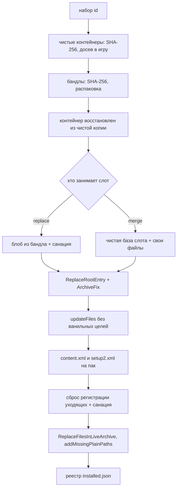

# Улучшения: почему набором

«Улучшения» - это моды, которые живут не в `update.rpf`, а в слотах чужих dlcpack: брендинг заправок, фонари, цветочные поля. Каждый такой мод занимает одну запись в корне контейнера вроде `update/x64/dlcpacks/patchday17ng/dlc1.rpf` - например `ntwstuff.rpf` или `lights.rpf`.

От остальных категорий лаунчера они отличаются двумя вещами, и обе меняют архитектуру установки. Первая: **контейнеров-слотов в ванильной игре не существует** - `dlc1.rpf` у `patchday17ng` и `mpvalentines2` создаёт установщик NG, на чистой копии их нет вовсе. Вторая: **слот бывает общим** - брендинг заправки и Flower Field делят один `ntwstuff.rpf`, и вынуть из него «своё», не тронув соседа, инкрементально нельзя.

Поэтому установка здесь декларативная. На вход `ImprovementInstallService.Apply` подаётся набор улучшений, которые должны стоять, и метод приводит игру ровно к этому состоянию. Установка, снятие и замена - один и тот же путь; отдельной ветки «удалить» в коде нет.

```cs title="MiamiGraphics.Core/Services/ImprovementManagerService.cs"
public Task<Result> RemoveAsync(string gtaRoot, string id, ...)
{
    var want = LoadRegistry().Items.Select(x => x.Id)
                .Where(x => !x.Equals(id, StringComparison.OrdinalIgnoreCase)).ToList();
    return ApplySetAsync(gtaRoot, want, catalog, download, progress, log, ct);
}
```

Снятие - это `ApplySetAsync` с набором «всё, кроме этого». Установка - `ApplySetAsync` с набором «всё, что было, плюс это». Реестр установленного лежит в `improvements/installed.json` и переписывается только после успеха.

## Досев контейнеров

Улучшению мало своего архива: сначала в игру надо положить сам контейнер. Каждая строка каталога везёт список `Requires` - путь относительно корня GTA, URL, SHA-256 и размер.

```cs title="MiamiGraphics.Core/Services/ImprovementManagerService.cs"
public sealed class RequiredContainer
{
    public string Path { get; set; } = "";      // update/x64/dlcpacks/patchday17ng/dlc1.rpf
    public string Url { get; set; } = "";
    public string Sha256 { get; set; } = "";
    public long SizeBytes { get; set; }
}
```

Контейнер качается один раз на все улучшения и оседает в `improvements/clean/` под плоским именем: `update/x64/dlcpacks/patchday17ng/dlc1.rpf` → `update_x64_dlcpacks_patchday17ng_dlc1.rpf`. Эта копия - не кеш загрузки, а **база пересборки**: при любой смене набора слот собирается заново от неё, а не от того, что сейчас лежит в игре.

Пустой `Sha256` в строке требования - закрытый отказ, а не «сверять нечем»:

```cs title="MiamiGraphics.Core/Services/ImprovementManagerService.cs"
if (string.IsNullOrWhiteSpace(r.Sha256))
    throw new InvalidOperationException(Loc.T("error.baseContainerNoSha", ("path", r.Path)));

if (File.Exists(dst) && new FileInfo(dst).Length == r.SizeBytes &&
    Sha256(dst).Equals(r.Sha256, StringComparison.OrdinalIgnoreCase))
    return;
```

Раньше здесь стояло «сверим, если задан», и пустой эталон делал своим любой файл подходящего размера - тот жил между запусками. При этом файл кладётся прямо в папку игры и становится базой слота, то есть весит больше самого архива улучшения.

В игру контейнер копируется только если его там нет. Если файл уже есть - не трогаем: он либо наш прошлый, либо от редукса, и `Apply` всё равно восстановит его из чистой копии перед сборкой. Всё, что мы физически положили в этот заход, пишется в список `placed`, и на любом отказе ниже `RollbackPlaced` его убирает - иначе после неудачной установки в игре остаются файлы, о которых реестр не знает, а значит их никто и никогда не снимет.

Путь контейнера приезжает из данных каталога, а «положить контейнер» - это `File.Copy` в папку игры. Строка вида `..\..\dinput8.dll` положила бы чужой файл туда, откуда GTA грузит код при запуске, поэтому весь набор проверяется через `SafePath.TryResolveInside` до первого байта загрузки.

## Пересборка слота: замена против слияния

Слот в манифесте описывается контейнером, именем записи и режимом.

| Поле | Что значит |
|---|---|
| `container` | путь rpf-контейнера относительно корня GTA |
| `entry` | имя вложенного архива в корне контейнера - `ntwstuff.rpf`, `lights.rpf`. Обязано быть именем, а не путём: `/` и `\` отбиваются |
| `mode` | `replace` или `merge`, по умолчанию `replace` |
| `file` | для `replace`: готовый блоб слота в бандле |
| `dir` | для `merge`: папка со своими файлами |

`replace` занимает слот целиком. Две заправки в `ntwstuff2.rpf` работают именно так, поэтому вместе они не встают - у них общий `exclusiveGroup`.

`merge` кладёт **только свои файлы** поверх чистой базы слота. Брендинг заправок и Flower Field делят `ntwstuff.rpf`, но своих файлов у них не пересекается ни одного, поэтому оба уживаются.

Конфликты внутри одного `entry` отбиваются до записи:

```cs title="MiamiGraphics.Core/Services/ImprovementInstallService.cs"
if (replacers.Count > 1)
    return Fail(result, Loc.T("error.slotClaimedByMany", ...));
if (replacers.Count == 1 && mergers.Count > 0)
    return Fail(result, Loc.T("error.slotClaimedWholeCannotMerge", ...));
...
var dup = own.GroupBy(x => x.Name, StringComparer.OrdinalIgnoreCase)
             .FirstOrDefault(g => g.Count() > 1);
if (dup != null) return Fail(result, Loc.T("error.slotDuplicateFile", ...));
```

Слот собирается блобом отдельно и кладётся в контейнер целиком. Дописать новый файл внутрь вложенного rpf на месте нельзя - `ReplaceFilesInLiveArchive` умеет добавлять записи только по обычным путям.

Паки dlcpacks лежат со взведённым старшим битом `namesLength` - так устроены 12 из 190 архивов чистой игры. Штатный ридер на них падает `OverflowException` ещё в `ReadHeader`, поэтому правим раскрытую копию, а `ArchiveFixer` в конце возвращает её в NG под финальным именем:

```cs title="MiamiGraphics.Core/Services/ImprovementInstallService.cs"
string? work = NgContainer.MakeReadableCopy(live);
string editTarget = work ?? live;
...
ReplaceRootEntry(editTarget, entry, blob);
...
ArchiveFixer.FixOrThrow(editTarget, finalName);
if (work != null) { File.Copy(work, live, overwrite: true); NgContainer.DropCopy(work); }
```

Имя при сборке блоба - всегда финальное имя записи. NG-ключ выводится из пары (имя, длина), и [ArchiveFix](../rpf/archivefix.md) шифрует архив под тем именем, которое файл носит на диске. По самому блобу второй раз `ArchiveFix` не гоняется: слоты - готовые подписанные архивы, тоже залоченные старшим битом, и fix-up на них падает. Корень контейнера подписывается один раз.

Флаги записи при вставке сбрасываются:

```cs title="MiamiGraphics.Core/Services/ImprovementInstallService.cs"
bin.Import(new MemoryStream(bytes));
bin.IsCompressed = false;
bin.IsEncrypted = false;
bin.UncompressedSize = bytes.LongLength;
```

Иначе игра попробует инфлейтить уже готовый архив.

## Регистрация в content.xml и setup2.xml

Слот, лежащий в контейнере, игра не видит. Чтобы устройство `dlc_PATCHDAY17NG` смонтировало `dlc1.rpf` и вытащило из него `ntwstuff.rpf`, нужны два файла в `update.rpf`:

- `dlc_patch/<pack>/setup2.xml` - `subPackCount` решает, сколько `dlcN.rpf` смонтируется рядом с `dlc.rpf`;
- `dlc_patch/<pack>/content.xml` - объявление записей в `<dataFiles>` **и** строки в `filesToEnable` нужного ченджсета.

Ванильный `patchday17ng/content.xml` не упоминает `ntwstuff.rpf` вообще, а у части паков этих файлов в ванильном `update.rpf` нет совсем. Поэтому запись идёт с `addMissingPlainPaths: true` - регистрацию надо именно добавить:

```cs title="MiamiGraphics.Core/Services/ImprovementInstallService.cs"
bool ok = PatchCustomizationSupport.ReplaceFilesInLiveArchive(
    updateRpf, updateReplacements, out int applied, out var skipped,
    addMissingPlainPaths: true);
```

Без регистрации улучшение выглядит установленным: контейнер лежит, блоб в нём, лог зелёный - а в игре ничего нет. Так и было с цветочными полями до появления этого блока.

Что просит объявить улучшение, описывает секция `registration` манифеста:

| Поле | Значение | Пример |
|---|---|---|
| `pack` | имя пака | `patchday17ng` |
| `device` | устройство как в content.xml | `dlc_PATCHDAY17NG` |
| `changeSet` | ченджсет, в `filesToEnable` которого добавлять строки | `CCS_PATCHDAY17_NG_STREAMING` |
| `subPackCount` | сколько `dlcN.rpf` монтировать | `1` и выше, берём максимум по паку |
| `rpf` | вложенные архивы слотов | `ntwstuff.rpf`, `lights.rpf` |
| `ityp` | `DLC_ITYP_REQUEST` | `ntwstuff.ityp`, `zc_lights.ityp` |
| `contentBaseFile` | ванильный `content.xml` пака - база сборки | лежит в бандле |
| `setup2BaseFile` | ванильный `setup2.xml` пака | лежит в бандле |

`subPackCount` правится регуляркой по ванильной базе, а не пересериализацией:

```cs title="MiamiGraphics.Core/Services/ImprovementInstallService.cs"
private static string SetSubPackCount(string setupXml, int n)
{
    var re = new Regex(@"<subPackCount\s+value=""\d+""\s*/>");
    if (!re.IsMatch(setupXml))
        throw new InvalidOperationException(Loc.T("error.baseSetup2NoSubPackCount"));
    return re.Replace(setupXml, $@"<subPackCount value=""{n}"" />", 1);
}
```

`content.xml` тоже правится текстом. У Rockstar в этих файлах свои отступы и порядок, и полная пересериализация переписала бы весь файл ради двух вставок. `<dataFiles>` дополняется блоками `RPF_FILE` и `DLC_ITYP_REQUEST`, после чего строки уезжают в `filesToEnable` - одних объявлений мало, без них игра ничего не стримит.

## Почему регистрацию собираем мы, а не везём готовой

Раньше улучшение везло **готовый** `content.xml`. Пока улучшение было одно на пак, это работало. Но заправке нужен `ntwstuff.rpf`, а фонарям - `lights.rpf`, и оба пишут один и тот же файл: кто встал вторым, тот и затирал объявление первого. Модели остаются в слоте, а игра их больше не видит.

Теперь улучшение везёт не файл, а список записей. `content.xml` собирается при установке из ванильной базы плюс объединение того, что просят все ставящиеся улучшения:

```cs title="MiamiGraphics.Core/Services/ImprovementInstallService.cs"
var rpfs  = reqs.SelectMany(r => r.Rpf).Distinct(StringComparer.OrdinalIgnoreCase).ToList();
var ityps = reqs.SelectMany(r => r.Ityp).Distinct(StringComparer.OrdinalIgnoreCase).ToList();
int subPacks = reqs.Max(r => Math.Max(1, r.SubPackCount));
```

Набор всегда согласован, а снятие убирает ровно свои строки.

Сборка из ванили создаёт вторую проблему: в этом же паке живут чужие моды. Редукс Gucci V2 включает свой основной груз - `gucciredux_v2.rpf`, 60 МБ таймциклов, прицела и миникарты - именно через `patchday17ng`, а не через корневой `content.xml`. Слепая пересборка сносила эти строки, файлы оставались в `update.rpf`, регистрация в корне была цела, а игра о них не знала. Выглядело это как «редукс установлен, но его не видно», и повторялось после каждой установки улучшения.

Поэтому перед сборкой мы читаем живой `content.xml` пака и переносим всё, чего нет ни в ванильной базе, ни среди имён улучшений:

```cs title="MiamiGraphics.Core/Services/ImprovementInstallService.cs"
if (inVanilla.Contains(item)) continue;

int slash = item.IndexOf(":/", StringComparison.Ordinal);
var device = slash >= 0 ? item[..slash] : "";
var name   = slash >= 0 ? item[(slash + 2)..] : item;
if (improvementOwned.Contains(name)) continue;

if (device.Equals(packDevice, StringComparison.OrdinalIgnoreCase))
{
    if (droppedOwnDevice.Count < 16) droppedOwnDevice.Add(item);
    continue;   // осколок чужого инсталлера
}
```

Исключение - записи устройства **самого** пака. Раз пак регистрируем мы, его устройство описывают только ваниль и улучшения; «чужая» запись своего устройства - это осколок NG-инсталлера (`dlc_mpValentines2:/1.rpf`, `stream.rpf`, `meta.rpf`, преаллоцированный инвентарь). Файлов за ней в контейнерах уже нет - мы кладём чистые, - а игра, смонтировав пак, честно идёт их искать и падает на заходе: `ERR CDataFileMgr dlc_mpValentines2:/1.rpf...5.rpf` → минидамп. Записи других устройств файлами пака не ограничены и переносятся как есть.

Имена, принадлежащие улучшениям, собираются не только по ставящемуся набору, но и по всем соседним бандлам в кеше. Иначе записи уходящего улучшения выглядели бы чужими и переносились бы навсегда.

## Снятие: контейнер и регистрация возвращаются вместе

Уходящие улучшения дают два отдельных списка:

- `ContainersToReset` - контейнеры, которые надо вернуть к чистому виду, хотя ни один манифест набора на них больше не ссылается. Без этого списка контейнеры брались только из манифестов набора, и снятие **последнего** жильца слота не чистило ничего: список пустой, восстанавливать нечего, а мод оставался в игре при бодром «улучшения сняты».
- `LeavingImprovementDirs` - папки бандлов уходящих. По их манифестам сбрасывается регистрация.

Второй список появился позже первого и закрывает более тяжёлый отказ. Контейнеры возвращались чистыми, а `dlc_patch/<pack>/content.xml` с `subPackCount >= 1` оставался в `update.rpf`. Игра монтировала слот по осевшей регистрации, не находила объявленных записей и падала на заходе - в логах `ERR_SYS_FILELOAD` на `dlc1..dlc5.rpf` и `dlc_mpValentines2:/1.rpf`.

Для каждого пака из уходящих, который не занят никем из набора, пишутся ванильные базы из его бандла - с тем же переносом чужих записей. Если живой файл уже равен ванильному (BOM в счёт не идёт), запись отменяется: гонять пересборку многогигабайтного `update.rpf` ради тех же байтов незачем.

Отдельно есть санация - список из 11 регистрационных файлов NG-инсталлера, которые старые бандлы разносили по `update.rpf` через `updateFiles` и которые оставались там навсегда. Правил три, и все три нужны:

1. пак, который в этом заходе регистрируем мы сами, не трогаем - его `content.xml` уже пересобран;
2. в ванили такого файла нет вовсе - удаляем (`mphalloween`, `mpspecialraces`, `mpvalentines2`, `mpheist/setup2`);
3. в ванили файл есть - возвращаем ванильный, но `content.xml` пересобираем с переносом чужих записей.

## Проверка целостности набора

Проверки стоят на всём пути, и каждая закрывает конкретный отказ.

| Что проверяем | Где | Отказ |
|---|---|---|
| Взаимоисключающие группы | `ApplySetAsync`, затем `Apply` | первый раз - до первого байта загрузки, второй - до первой записи на диск |
| SHA-256 бандла и чистого контейнера | `EnsureBundleAsync`, `EnsureCleanContainerAsync` | пустой хеш - тоже отказ; в тексте ошибки печатаются первые 16 символов ожидаемого и полученного |
| Пути из манифеста и каталога | `SafePath.TryResolveInside` / `IsSafeRelative` | весь набор целиком, до первой записи |
| `entry` как имя, а не путь | `Apply` | `/` и `\` в имени слота |
| Двойной захват слота | `Apply` | два `replace`, либо `replace` вместе с `merge` |
| Дубли имён при слиянии | `Apply` | один файл от двух улучшений |
| Содержимое записей слота | `DropFiller` | пустышки выбрасываются |
| Размер ресурса | `RpfResourceBudget` | отказ на 90 МБ при потолке клиента 100 МБ |

Санация блоба - самая неочевидная из них. NG при удалении мода не выкидывает запись, а забивает её посторонними байтами того же размера, чтобы не двигать смещения в преаллоцированном слоте. Пока слот не зарегистрирован, это безвредно. Как только слот попадает в `content.xml`, GTA заносит все его записи в streaming index по имени, а тип ассета выбирает по расширению - и пустышка под именем `.yft` разбирается как fragment. У ресурсов RPF7 размер не хранится, а вычисляется из `SystemFlags`/`GraphicsFlags`; поля чужого заголовка читаются как счётчики страниц, размер выходит абсурдный, и дальше по цепочке: `Oversized file (>100MB)` → `ERR_STR_FAILURE_3` → клиенту возвращается ноль → разыменование нуля.

Реальный случай: `prop_sign_road_03e.yft`, 35 387 байт, magic `.}w@` вместо `RSC7`. В merge-слоте его выбрасывал `DropFiller`, а внутри `replace`-блоба он ехал в игру как есть - чистота держалась только на том, что кто-то вручную прогнал чистку перед сборкой бандла.

```cs title="MiamiGraphics.Core/Services/RpfEntrySanity.cs"
public static readonly string[] ResourceExtensions =
    { ".ydr", ".yft", ".ytd", ".ymap", ".ytyp", ".ycd", ".yld", ".ypt", ".ybn", ".yed", ".ynv" };

public static bool IsRsc7(byte[]? d) =>
    d is { Length: >= 4 } && d[0] == 0x52 && d[1] == 0x53 && d[2] == 0x43 && d[3] == 0x37;

public static bool IsRpf7(byte[]? d) =>
    d is { Length: >= 4 } && d[0] == 0x37 && d[1] == 0x46 && d[2] == 0x50 && d[3] == 0x52;
```

Пара несимметрична, и путать её нельзя. `RSC7` лежит на диске как есть, а идентификатор `RPF7` - это `uint32 0x52504637` в little-endian, то есть байты идут `37 46 50 52` («7FPR»). Сравнение с `'R','P','F','7'` не совпало бы никогда, и любой настоящий вложенный архив в корне merge-базы уезжал бы в «фейковые».

Проверять надо только записи с ресурсным именем и вложенные rpf: у настоящего ресурса заголовок достраивается из полей самой записи, так что подделкой может быть лишь бинарная запись с ресурсным именем. Байты читаются у единиц записей, проверка стоит четыре байта на запись.

Чистый блоб возвращается **байт в байт** - пересборка, а с ней переподпись NG, идёт только когда что-то выброшено. Если пустышки найдены, а вычистить их не вышло - установка отбивается: такой слот роняет игру гарантированно, и «поставилось, но крашит» хуже честного отказа. Если же до разбора дело не дошло (нечитаемый блоб, отсутствующий `ArchiveFix`), ставим как есть - санация здесь страховка, а не обязательный шаг.

## Файлы в update.rpf: почему ванильные цели отбрасываются

Кроме слотов улучшение может везти точечные замены внутри `update.rpf` - секция `updateFiles`. Здесь стоит фильтр по чистому `update.rpf` лаунчера:

```cs title="MiamiGraphics.Core/Services/ImprovementInstallService.cs"
if (vanilla.IsSameAsVanilla(uf.Target, bytes))
{
    vanillaSkipped.Add(uf.Target);
    continue;
}
```

Цель, чей файл байт в байт равен ванильному, не добавляет улучшению ничего - в игре и так лежала бы ваниль, если бы никто её не трогал. Зато такая запись затирает чужие моды по тем же путям. Один из бандлов был собран слишком широко и вёз 31 ванильный файл: все `timecycle/*.xml`, `cloudkeyframes`, `clouds`, `weather`, `visualsettings`, `hbaosettings`, `bloodfx`, `wheelfx`, `hudcolor`, - хотя сам мод про отверстия от пуль, следы шин и кровь. Игрок видел «редукс установлен, а таймциклы дефолтные»: это буквально ванильные файлы поверх редуксовых.

Чистый `update.rpf` открывается один раз на весь набор и под именем `update.rpf`, а не под тем, что у копии на диске: NG-ключ TOC выводится из имени, а бэкап лежит как `update_<версия>.rpf`. Без пути к чистой копии `VanillaLookup` всегда отвечает «не ваниль», то есть поведение остаётся прежним.

## Порядок операций



Реестр пишется последним - только после успеха всей цепочки.

## Возврат после пересборки update.rpf

Пересборка слотов переписывает `update.rpf`, и оверлеи, живущие в тех же путях, после неё исчезают. У редукса и его кастомизации цепочка возврата была с самого начала, у улучшений её не было: снятие цветочных полей унесло большую карту - в игре осталось 2 цели из 18, зум обрубился, дальние планы посыпались.

Теперь после успешного `Apply` вызываются те же best-effort возвраты, что и у редукса. Обратная сторона тоже есть: любая пересборка `update.rpf` из других сценариев зовёт `ReapplyImprovementsIfAnyAsync`, который прогоняет `ApplySetAsync` по всему реестру. Работает по реестру, а не по конкретному улучшению, поэтому новые улучшения подхватываются сами.

Отдельно живёт `WipeAllLocal`: «Откатить всё» возвращает игру подменой чистых `update.rpf` и `dlc.rpf`, а контейнеры улучшений лежат отдельными файлами, и чистая копия `update.rpf` их не касается. Раньше откат их не трогал вовсе - лаунчер рапортовал «всё снято», реестр улучшений переживал откат, а мод оставался и в игре, и на карточке. Метод не требует ни каталога, ни сети: контейнеры берутся из локальных манифестов бандлов, а чистые копии - из `improvements/clean/`.

Смежное чтение: [структура RPF8](../rpf/index.md), [шифрование AES и NG](../rpf/encryption.md), [ArchiveFix.exe](../rpf/archivefix.md).
