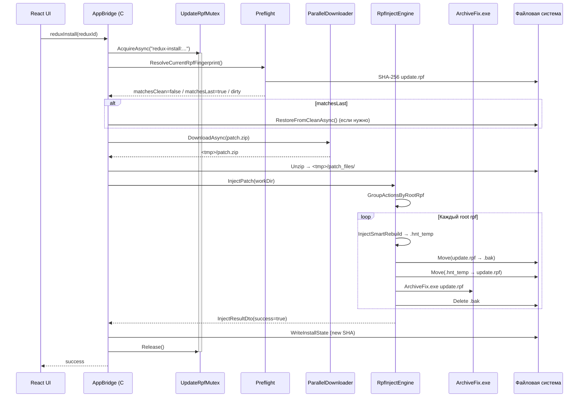

# Pipeline инжекта


Когда юзер кликает «Установить» на каком-то моде, начинается **install pipeline**. С точки зрения UI это просто прогресс-бар. На самом деле под капотом 8 шагов.

## Полный путь



## Шаги детально

### 1. Mutex acquire

Прежде чем что-то трогать, занимаем глобальный mutex `UpdateRpfMutex`. Это `SemaphoreSlim(1,1)` в процессе.

Зачем - юзер может ткнуть «установить» сразу на два мода (например двойной клик, или клик на ганпак а потом на бронежилет, а первый ещё не доделал). Без mutex два install pipeline'а пойдут параллельно, оба попытаются модифицировать `update.rpf`, и **испортят файл** (один пишет в `.hnt_temp` одного rebuild'а, другой переписывает поверх). У нас был [баг с этим](mutex.md).

```cs title="MiamiGraphics.Shell/Services/UpdateRpfMutex.cs"
public static async Task<IDisposable> AcquireAsync(string holderName, CancellationToken ct = default)
{
    var entered = await _mutex.WaitAsync(AcquireTimeout, ct);
    if (!entered)
        throw new TimeoutException($"UpdateRpfMutex acquire timeout (current: {_currentHolder})");
    return new Releaser(holderName);
}
```

Использование:

```cs title="MiamiGraphics.Shell/Bridge/AppBridge.cs"
public async Task<InjectResultDto> ReduxInstallAsync(string reduxId, Guid? versionId)
{
    using var _ = await UpdateRpfMutex.AcquireAsync($"redux-install:{reduxId}");
    // дальше всё что трогает update.rpf
}
```

`using` гарантирует release даже на exception. Timeout 10 минут - install теоретически может быть долгим (огромный мод + медленный диск), но не бесконечным.

### 2. Preflight: что у юзера лежит сейчас?

См. [Preflight](preflight.md) подробно.

Кратко: считаем SHA-256 текущего `update.rpf`, сравниваем с:

- **CLEAN** - reference SHA для версии GTA из таблицы `gta_versions` в Supabase;
- **LAST** - SHA после нашего последнего успешного install из `install_state.json`.

Три ветки:

| Состояние | Что делаем |
|---|---|
| **matchesClean** | Файл чистый. Сразу инжектим (никаких восстановлений). |
| **matchesLast** | Файл это наш предыдущий install. **Восстанавливаем clean** из локального кеша, потом инжектим. Это нужно потому что Smart Rebuild работает только с чистой версией - мы не умеем «убрать прошлый мод» из существующего файла. |
| **DIRTY** | Файл не сходится ни с clean ни с last. Кто-то его руками правил (другой лаунчер, ручной mod install). **Спрашиваем юзера** разрешение перетереть. Если разрешил - RestoreFromClean → инжект. |

### 3. Download patch.zip

`ParallelDownloader` - наш HTTP-клиент с 8 параллельных Range-стримов для файлов > 8 МБ. На медленном Cloudflare egress в РФ это даёт 5× скорости против single-stream:

- Single 4 МБ/с в РФ через CF anycast;
- 8× parallel ~30-50 МБ/с (упирается в client bandwidth, не в R2).

Для маленьких файлов (manifest.json, отдельные компоненты при customize) - single stream без overhead'а.

```cs title="MiamiGraphics.Shell/Bridge/AppBridge.cs"
await ParallelDownloader.DownloadAsync(effectiveUrl, destPath, bytesProgress, ct: ct);
```

`effectiveUrl` - после прохождения через [MirrorSelector](../network/fragmenting-http-handler.md) (RU юзеры через прокси, EU прямо на CF).

### 4. Unzip + проверка SHA

После download'а распаковываем `patch.zip`. Проверяем SHA-256 каждого файла из manifest. Несовпадение SHA = ошибка download'а, install прерывается.

### 5. Snapshot перед инжектом (`.preinstall`)

Перед запуском Smart Rebuild **копируем** текущий `update.rpf` в rollback файл:

```cs title="MiamiGraphics.Shell/Bridge/AppBridge.cs:4079"
await Task.Run(() => File.Copy(updateRpf, rollbackPath, overwrite: true));
```

Зачем - если что-то пойдёт не так на следующих шагах (Smart Rebuild упал, ArchiveFix отказался, диск кончился) - у нас есть **точная** копия того что было до. Восстановим через `TryRollbackAsync`.

### 6. Smart Rebuild

См. [Smart Rebuild](smart-rebuild.md).

Открываем чистый `update.rpf`, обходим дерево, копируем нетронутые файлы, применяем actions из manifest, рекурсивно работаем со вложенными `.rpf`. Результат пишем в `update.rpf.hnt_temp`.

### 7. Atomic swap

Три File.Move'а атомарной заменой:

```cs title="MiamiGraphics.Core/Injector/RpfInjectEngine.cs:151"
if (File.Exists(backupPath)) File.Delete(backupPath);
File.Move(sourceArchivePath, backupPath);     // update.rpf → update.rpf.bak
File.Move(tempPath, sourceArchivePath);       // update.rpf.hnt_temp → update.rpf
File.Delete(backupPath);                       // удаляем .bak
```

Между шагом 2 и 3 есть **окно** где `update.rpf` физически отсутствует - он переименован в `.bak`. Если процесс килляют именно тут (SIGKILL, питание, BSOD) - у юзера в `<gta>/update/` лежит `update.rpf.bak` без `update.rpf`. Игра не запустится.

Это покрыто [OrphanBackupRecovery](rollback.md) - startup-сканер ищет такие висячие `.bak` и переименовывает обратно при следующем запуске Miami Graphics. См. историю - это был [реальный инцидент](../history/ragelib-v2.md).

### 8. ArchiveFix.exe

После того как новый `update.rpf` лежит на месте, запускаем [ArchiveFix](../rpf/archivefix.md) для пересчёта хешей. Это **обязательный** шаг - без него игра отбросит файл.

```cs
if (success) FixArchive(absoluteRootPath);
```

15 секунд timeout. Если упал - установка считается **неуспешной**, делаем rollback (восстанавливаем `update.rpf` из `.preinstall`).

### 9. Запись install_state

После полного успеха пишем новый SHA в `install_state.json`:

```json
{
  "InstalledReduxId": "kukanka-redux",
  "InstalledVersionId": "abc-...-uuid",
  "PostInstallSha256": "f3a8b2c1...",
  "InstalledAt": "2026-05-19T16:23:45Z"
}
```

Следующий install увидит `matchesLast = true` для этого SHA, поймёт что юзер не трогал файл руками.

### 10. Mutex release + UI notify

`using var _` диспоузится, semaphore освобождается. UI получает `InjectResultDto(success=true)` и показывает toast «установлено».

## Время выполнения

| Шаг | Время на NVMe SSD | Время на HDD |
|---|---|---|
| Preflight (SHA 2 ГБ файла) | 2-4 сек | 15-30 сек |
| Download patch (200 МБ) | 30-60 сек (зависит от инета) | то же |
| Unzip + SHA check | 1-2 сек | 5-10 сек |
| Snapshot copy (`.preinstall`) | 4-8 сек | 30-60 сек |
| Smart Rebuild (2 ГБ) | **6 сек** | 90-180 сек |
| ArchiveFix | 3-4 сек | 8-15 сек |
| **Total user-facing** | **~50 сек** | **3-5 минут** |

Большая часть времени - **download** и **snapshot copy**. Smart Rebuild на NVMe это 6 секунд - это была [главная победа](../history/ragelib-v2.md). До оптимизации та же операция занимала 4 минуты.

[Дальше: Preflight подробно →](preflight.md)
