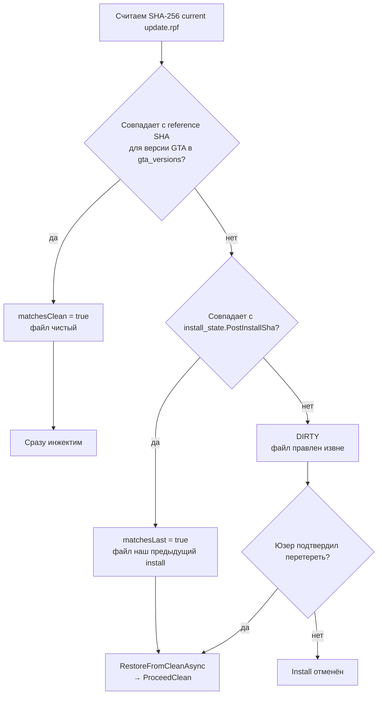
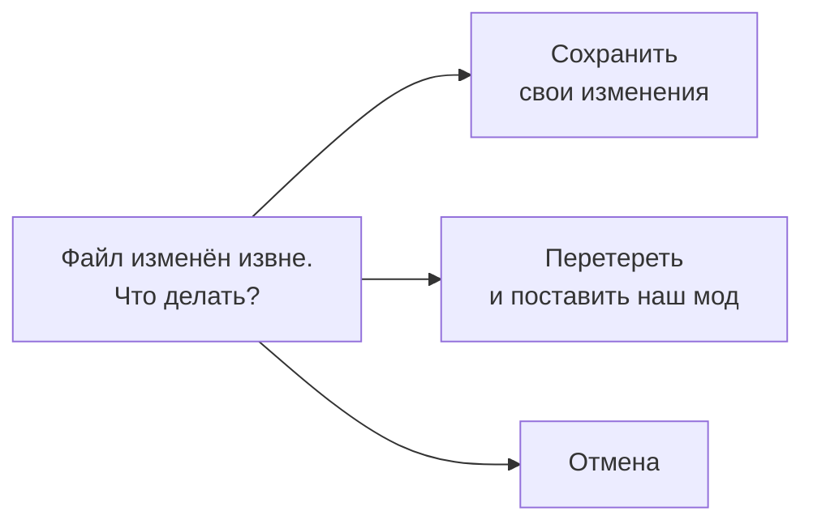

# Preflight: CLEAN / LAST / DIRTY

Это **первый** шаг после Mutex acquire в любом install pipeline. Цель - понять что у юзера сейчас лежит в `update.rpf`, чтобы решить можно ли сразу инжектить или нужно сначала восстанавливать чистую версию.

## Алгоритм



## Откуда берутся эталонные SHA

### CLEAN: таблица `gta_versions` в Supabase

```sql
create table public.gta_versions (
    exe_version text primary key,         -- '1.0.3788.0'
    update_rpf_sha256 text not null,
    update_rpf_size bigint not null,
    dlc_rpf_sha256 text not null,
    dlc_rpf_size bigint not null
);
```

При первом запуске лаунчер определяет версию GTA через `FileVersionInfo.GetVersionInfo("GTA5.exe").FileVersion`, идёт в Supabase, забирает reference SHA для этой версии. Эти данные админ заполняет при выходе нового патча от Rockstar.

Если версии GTA у юзера **нет в таблице** (новый патч который мы ещё не обработали) - backup pipeline помечает `versionUnsupported=true`, и install будет идти через **DIRTY**-путь (с запросом подтверждения у юзера).

### LAST: `install_state.json` локально

```
%LocalAppData%\MiamiGraphics\config\install_state.json
```

```json
{
  "InstalledReduxId": "kukanka-redux",
  "InstalledVersionId": "abc-uuid",
  "PostInstallSha256": "f3a8b2c1de4...",
  "InstalledAt": "2026-05-19T16:23:45Z"
}
```

Пишется **только при успешном** install (включая ArchiveFix). Если что-то упало - не пишется, и следующий install увидит несоответствие (тут уже DIRTY-путь сработает в pessimistic режиме).

## Pseudocode preflight

```cs title="MiamiGraphics.Shell/Bridge/AppBridge.cs (ReduxInstallInternalAsync)"
var currentSha = await Task.Run(() => ComputeFileSha256(updateRpf));
var state = ReadInstallState();
var matchesLast = state?.PostInstallSha256 is { } lastSha
    && string.Equals(currentSha, lastSha, StringComparison.OrdinalIgnoreCase);
var matchesClean = await IsRpfCleanAsync(currentSha, gtaRoot);

Debug.WriteLine($"[redux.install] preflight: current={currentSha[..16]} " +
                $"matchesLast={matchesLast} matchesClean={matchesClean}");

if (matchesClean)
{
    // case 1: сразу инжектим
}
else if (matchesLast)
{
    // case 2: auto-restore clean → инжектим
    await _backupService.RestoreFromCleanAsync(gtaRoot, CancellationToken.None);
}
else if (force)
{
    // case 3a: юзер подтвердил DIRTY override (force = true)
    await _backupService.RestoreFromCleanAsync(gtaRoot, CancellationToken.None);
}
else
{
    // case 3b: DIRTY без подтверждения → возвращаем ошибку с кодом
    return new InjectResultDto(false, ERROR_DIRTY_FILES, null);
    // UI показывает 3-way modal: Preserve / Force / Cancel
}
```

`ERROR_DIRTY_FILES` это специальная константа которую UI ловит:

```cs title="MiamiGraphics.Shell/Bridge/AppBridge.cs"
private const string ERROR_DIRTY_FILES = "DIRTY_FILES_NEED_CONFIRM";
```

```ts title="MiamiGraphics.Shell/ui/src/screens/redux/ReduxDetail.tsx"
const r = await install(item.id, effectiveVersionId);
if (!r.success && r.errorMessage === 'DIRTY_FILES_NEED_CONFIRM') {
    setDirtyConfirm(true);  // открываем модалку
}
```

## 3-way modal на DIRTY

Когда у юзера файл DIRTY (правлен другим лаунчером), мы показываем три варианта:



| Кнопка | Что делает |
|---|---|
| **Сохранить свои изменения** | Запускает «preserve flow» - qol-mode где мы попытаемся вычленить юзерские изменения, поставить наш мод поверх, и попытаться смерджить. Сложная логика, см. `ReduxInstallPreserveAsync`. Реалистично смерджит только если изменения юзера не пересекаются с нашими по файлам. |
| **Перетереть** | Force-mode. Restore-clean → инжект. Юзер потеряет всё что было кастомно. |
| **Отмена** | Просто закрываем модалку. Ничего не меняется. |

## Auto-restore логика

Когда `matchesLast = true` - это **самый частый** случай в реальном использовании (юзер ставит мод A → потом ставит мод B → потом сменил решение). Если бы мы каждый раз спрашивали разрешение перетереть, юзер сошёл бы с ума.

Поэтому при `matchesLast` мы **молча** делаем restore-clean без UI-подтверждения. Юзер не знал что внутри Smart Rebuild начинается с чистой ваниль - для него это просто «установка мода B».

Это позволило сделать [быстрый чейн установок](../inject/smart-rebuild.md): A → B → C, каждая занимает 50 секунд, без диалогов.

## Что считается «своими изменениями»

В наивной реализации мы не различаем:

- юзер сам в CodeWalker открыл `update.rpf` и поменял `weapons.meta`;
- античит другого RP-сервера обновил `weapons_attachments.meta`;
- ручной install какого-то ютуб-mod'а пол-года назад.

Всё это для нас выглядит одинаково: **SHA не сошёлся ни с CLEAN ни с LAST**. UI просит подтверждение, юзер обычно тыкает «перетереть» и забывает что у него вообще было.

Это **сознательное** упрощение. Полноценный merge нескольких модов был бы сложным и хрупким - даже Vortex Mod Manager не делает это надёжно для GTA. Лучше явный «знаешь ли ты что у тебя сейчас?» вопрос чем тихий мердж который может тихо сломаться.

## Edge case: install_state не существует

При первом install после установки лаунчера `install_state.json` отсутствует:

```cs
var state = ReadInstallState();   // = null
var matchesLast = state?.PostInstallSha256 is { } lastSha && ...;   // false
```

Если у юзера при этом `matchesClean = true` → сразу инжект. Это **первая установка**.

Если у юзера `matchesClean = false` тоже (он играл с модами до прихода к нам) → DIRTY с подтверждением. Юзер согласится → restore-clean из CDN → инжект.

См. также [гарды и failure modes](../protection/guards.md).

[Дальше: Smart Rebuild →](smart-rebuild.md)
