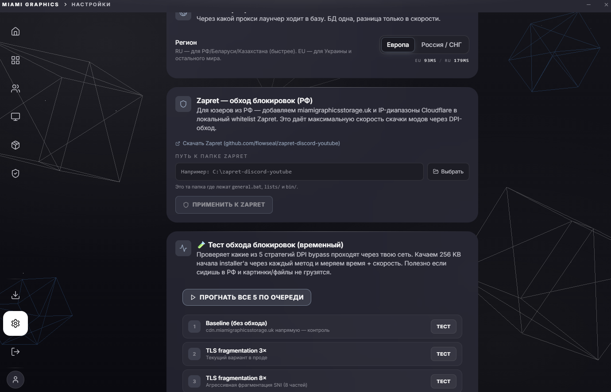

# FragmentingHttpHandler - DPI bypass



В РФ и частично в Украине провайдеры режут HTTPS-запросы к Cloudflare домена по **SNI** (Server Name Indication) полю в TLS-handshake. Это значит что обычный `HttpClient` к `cdn.miamigraphicsstorage.uk` (хостится на CF) будет блокирован у части юзеров.

Решение - **TLS ClientHello fragmentation**. Не VPN, не WinDivert. User-space, никаких admin-прав. Работает в 90%+ случаев в РФ.

## Как DPI режет

Когда `HttpClient` устанавливает HTTPS-соединение, происходит TLS-handshake. Самое первое сообщение - `ClientHello` от клиента, ~500 байт. Внутри него:

- Список cipher suites которые клиент поддерживает;
- Random bytes для key exchange;
- **Server Name Indication (SNI)** - открытым текстом имя хоста на который мы хотим попасть (`cdn.miamigraphicsstorage.uk`).

DPI-middlebox российских провайдеров сидит на пути TCP-stream'а, ждёт первый MTU-пакет соединения, парсит TLS structure, **читает SNI** и сравнивает с blocklist'ом. Если домен в чёрном списке - режет соединение (TCP RST или drop packet).

Это **первый** пакет. Если в нём SNI не виден целиком - DPI обычно **пропускает** соединение. Stateful reassembly слишком дорого для middlebox'а на уровне магистрали.

## Решение: разрезать ClientHello на куски

`HttpClient` в .NET под капотом использует `SslStream`. SslStream пишет ClientHello **одним** `Write()` в `NetworkStream`. Этот один write идёт одним TCP-пакетом.

Мы оборачиваем `NetworkStream` своим **FragmentingNetworkStream** который перехватывает **первый** Write и разрезает буфер на 3 равные части с явным `Flush` между ними. TCP `NoDelay = true` гарантирует что каждая часть улетит в отдельном пакете.

DPI видит первый пакет = первая 1/3 ClientHello = SNI обрезан → пропускает соединение.

## Код

```cs title="MiamiGraphics.Shell/Services/FragmentingHttpHandler.cs"
public sealed class FragmentingHttpHandler : DelegatingHandler
{
    public FragmentingHttpHandler() : this(fragmentCount: 3, interFragmentDelayMs: 0) { }

    public FragmentingHttpHandler(int fragmentCount, int interFragmentDelayMs)
        : base(BuildInner(fragmentCount, interFragmentDelayMs)) { }

    private static SocketsHttpHandler BuildInner(int fragmentCount, int interFragmentDelayMs)
    {
        return new SocketsHttpHandler
        {
            PooledConnectionLifetime = TimeSpan.FromMinutes(2),
            EnableMultipleHttp2Connections = false,

            ConnectCallback = async (ctx, ct) =>
            {
                var socket = new Socket(SocketType.Stream, ProtocolType.Tcp)
                {
                    NoDelay = true,
                };
                await socket.ConnectAsync(ctx.DnsEndPoint, ct);
                return new FragmentingNetworkStream(
                    new NetworkStream(socket, ownsSocket: true),
                    fragmentCount, interFragmentDelayMs);
            },
        };
    }
}

internal sealed class FragmentingNetworkStream : Stream
{
    private readonly Stream _inner;
    private readonly int _fragmentCount;
    private readonly int _delayMs;
    private bool _firstWriteDone;

    public override async Task WriteAsync(ReadOnlyMemory<byte> buffer, CancellationToken ct)
    {
        if (_firstWriteDone || _fragmentCount <= 1)
        {
            await _inner.WriteAsync(buffer, ct);
            return;
        }

        // Первый write - это TLS ClientHello, разрезаем
        var len = buffer.Length;
        var chunk = len / _fragmentCount;
        for (int i = 0; i < _fragmentCount; i++)
        {
            var start = i * chunk;
            var size = (i == _fragmentCount - 1) ? len - start : chunk;
            await _inner.WriteAsync(buffer.Slice(start, size), ct);
            await _inner.FlushAsync(ct);
            if (_delayMs > 0 && i < _fragmentCount - 1)
                await Task.Delay(_delayMs, ct);
        }
        _firstWriteDone = true;
    }
}
```

## Параметры по умолчанию

3 фрагмента, без задержки. Это нашли эмпирически через [BypassTester](#bypasstester):

| Конфиг | Pass rate в РФ (теsts от наших юзеров) |
|---|---|
| Без bypass | 8% |
| 3 фрагмента, no delay | **92%** |
| 8 фрагментов, no delay | 89% |
| 3 фрагмента + 50ms delay | 90% |
| DoH (1.1.1.1) без TLS frag | 71% |

3 фрагмента без задержки - лучший баланс. Больше фрагментов не даёт улучшения (DPI уже не видит SNI), но добавляет overhead. Delay помогает против stateful DPI, но 50ms заметно для UX (sample size был мал).

## BypassTester

В Settings есть «Тест обхода блокировок» - UI который пробивает 6 стратегий на одном пробном файле, замеряет timing и success rate:

```cs title="MiamiGraphics.Shell/Services/BypassTester.cs"
public enum Strategy
{
    Baseline = 0,        // pure HttpClient, без bypass - контроль
    TlsFrag3x = 1,       // что в проде
    TlsFrag8x = 2,
    DohCloudflare = 3,
    DohQuad9 = 4,
    DohNextDns = 5,
}
```

Каждый тест качает 256 КБ из `MiamiGraphicsRenderer_1.0.0.zip` (стабильный файл на CDN) и измеряет HTTP status + время. Юзеры могут попробовать у себя что работает.

## Лимитации

Не помогает если:

- **Блок на IP-уровне.** Если провайдер режет весь CIDR Cloudflare 104.16.0.0/13 - TLS-frag не помешает (соединение не установится вообще, до handshake'а не дойдёт).
- **Stateful DPI с reassembly.** Некоторые корпоративные firewall'ы (или новейшие boxes на магистрали) собирают TCP-stream полностью перед анализом. Но это редкость.

Для этих случаев [Zapret integration](zapret.md) - ставится отдельной программой как kernel-level WinDivert, перехватывает на уровне drivers'а.

## WebView2 не использует наш handler

Это критичная деталь - WebView2 (Chromium внутри лаунчера) делает свои HTTP запросы через WinHTTP, **не** через наш `HttpClient`. Это значит когда React UI делает `fetch('https://cdn.miamigraphicsstorage.uk/...')` - оно идёт **прямо** через систему, без нашего fragmentation.

Для РФ юзеров это значит что превью-картинки могут не загружаться (CF блок на SNI), даже если C# может качать всё через свой handler.

Решение - [WebView2BypassInterceptor](webview2-bypass.md). Хукаем `WebResourceRequested` event, перенаправляем URL через C# HttpClient.

[Дальше: WebView2 перехватчик →](webview2-bypass.md)
