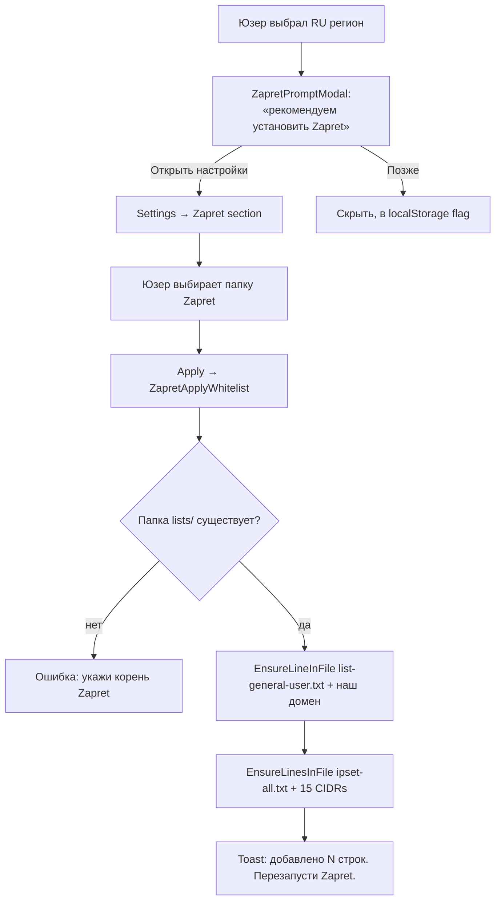

# Zapret integration

[Zapret](https://github.com/Flowseal/zapret-discord-youtube) - стороннее open-source средство DPI-обхода для РФ. Работает через **WinDivert** (kernel-mode driver), перехватывает пакеты на уровне ОС, фрагментирует ClientHello как наш [FragmentingHttpHandler](fragmenting-http-handler.md), но **глобально** для всех приложений.

Юзер ставит Zapret отдельно. Мы предлагаем интеграцию - добавить наш домен в его whitelist чтобы наш трафик шёл через Zapret-туннель.

## Зачем

Наш FragmentingHttpHandler работает для **наших** HTTP-запросов из C# и через WebView2BypassInterceptor. Но:

- WebView2 для **сторонних** доменов (внешних ссылок на youtube видео в карточках модов) не идёт через наш interceptor.
- 3D modules в UI грузят `.glb` через native WebGL fetch - тоже WinHTTP, не наш handler.

Для пользователей с агрессивным DPI это значит часть UI не работает. Zapret глобально решает.

## Что мы делаем

Добавляем в **локальные whitelist-файлы** Zapret'а:

- `lists/list-general-user.txt` - наш домен `miamigraphicsstorage.uk`;
- `lists/ipset-all.txt` - все 15 CIDR-диапазонов Cloudflare IPv4.

```cs title="MiamiGraphics.Shell/Services/ZapretIntegration.cs"
public static readonly string[] CloudflareRanges =
{
    "103.21.244.0/22",  "103.22.200.0/22",  "103.31.4.0/22",
    "104.16.0.0/13",    "104.24.0.0/14",    "108.162.192.0/18",
    "131.0.72.0/22",    "141.101.64.0/18",  "162.158.0.0/15",
    "172.64.0.0/13",    "173.245.48.0/20",  "188.114.96.0/20",
    "190.93.240.0/20",  "197.234.240.0/22", "198.41.128.0/17",
};
```

Эти 15 CIDR - **публичный** список всех IP-диапазонов Cloudflare (источник: `https://www.cloudflare.com/ips-v4`). Не меняется годами.

## UI flow



## Идемпотентность

Apply пишет через `EnsureLineInFile` / `EnsureLinesInFile` - проверяем что строка уже есть, не добавляем дубликат:

```cs title="MiamiGraphics.Shell/Services/ZapretIntegration.cs"
private static int EnsureLineInFile(string path, string line)
{
    var existing = File.Exists(path) ? File.ReadAllLines(path) : Array.Empty<string>();
    if (existing.Any(l => string.Equals(l.Trim(), line, StringComparison.OrdinalIgnoreCase)))
        return 0;   // уже есть

    var needsLeadingNewline = existing.Length > 0
        && !string.IsNullOrEmpty(existing[^1])
        && !File.ReadAllText(path).EndsWith("\n");
    var prefix = needsLeadingNewline ? Environment.NewLine : string.Empty;
    File.AppendAllText(path, prefix + line + Environment.NewLine);
    return 1;
}
```

Юзер может кликать «Применить» 100 раз - после первого раза каждое следующее показывает «уже добавлено». Никакой коррупции файлов.

## ZapretPromptModal

Появляется **один раз** при первом запуске после выбора RU региона:

```ts title="MiamiGraphics.Shell/ui/src/components/ZapretPromptModal.tsx"
const STORAGE_KEY = 'hntgraph.zapretPromptSeen';

export function isZapretPromptSeen(): boolean {
    try { return window.localStorage.getItem(STORAGE_KEY) === '1'; }
    catch { return false; }
}

export function markZapretPromptSeen(): void {
    try { window.localStorage.setItem(STORAGE_KEY, '1'); } catch { }
}
```

В App.tsx mount-effect:

```ts
if (status.isConfigured && status.region === 'ru' && !isZapretPromptSeen()) {
    setZapretPromptOpen(true);
}
```

EU юзерам promptа не показываем - у них прямой коннект к Swiss VPS без DPI-проблем.

## После применения

Zapret требует **перезапуск** его сервиса (`general.bat`) чтобы новые правила вступили в силу. Мы это явно говорим юзеру в toast'е:

> Готово.
> Добавлено: домен - 1, IP-диапазоны - 15.
> Перезапусти Zapret (general.bat), чтобы изменения вступили в силу.

Сами мы **не** трогаем процесс Zapret - это не наша программа, не имеем права без разрешения.

## Что Zapret покрывает

После применения наших правил Zapret:

- Фрагментирует ClientHello для **всех** соединений к Cloudflare IPs (включая WebView2 fetch, native WebGL, наши собственные HTTP);
- Хелпит даже там где наш FragmentingHttpHandler не доезжает (например при `RestoreFromClean` где мы качаем 2 ГБ с CF и наш handler в это время уже отключен).

Это **глобально для системы** - пока Zapret работает в фоне. Юзеру нужно один раз настроить, дальше всё прозрачно.

[Дальше: обновления →](../update/inno-supabase.md)
