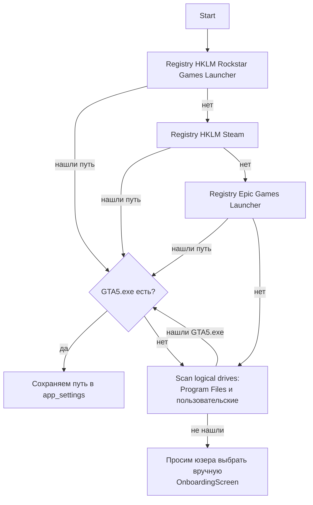

# GTA detection

При первом запуске нам нужно понять **где** у юзера установлен GTA V. Это `HardwareLocator` - пробует разные источники по очереди.

## Полный алгоритм



## Реальные паттерны установки

| Source | Где обычно лежит |
|---|---|
| Rockstar Launcher (новый install после 2024) | `C:\Program Files\Rockstar Games\Grand Theft Auto V\` |
| Rockstar Launcher (legacy) | `C:\Program Files (x86)\Rockstar Games\Grand Theft Auto V\` |
| Steam | `C:\Program Files (x86)\Steam\steamapps\common\Grand Theft Auto V\` |
| Steam на не-C диске | `D:\SteamLibrary\steamapps\common\Grand Theft Auto V\` |
| Epic Games | `C:\Program Files\Epic Games\GTAV\` |
| Пиратка | `D:\Games\GTA V\` или `C:\GTAV\` или что угодно |
| RP-сервер кастомный лаунчер | часто под `%LocalAppData%\<server-name>\GTA5\` |

Поэтому полагаться только на registry нельзя - кастомные лаунчеры в реестр не пишут.

## Registry-based

```cs title="MiamiGraphics.Core/System/HardwareLocator.cs (упрощено)"
public string? FindGtaPath()
{
    // 1. Rockstar Launcher
    var rs = ReadRegistry(@"HKEY_LOCAL_MACHINE\SOFTWARE\Rockstar Games\Grand Theft Auto V", "InstallFolder");
    if (IsValidGtaFolder(rs)) return rs;

    // 2. WOW6432Node для 32-bit инсталляций
    var rs32 = ReadRegistry(@"HKEY_LOCAL_MACHINE\SOFTWARE\WOW6432Node\Rockstar Games\Grand Theft Auto V", "InstallFolder");
    if (IsValidGtaFolder(rs32)) return rs32;

    // 3. Steam - пути из общего реестра Steam + библиотек
    var steamPath = ReadRegistry(@"HKEY_CURRENT_USER\Software\Valve\Steam", "SteamPath");
    if (!string.IsNullOrEmpty(steamPath))
    {
        // ищем GTA V app id 271590 в его библиотеках
        foreach (var lib in GetSteamLibraries(steamPath))
        {
            var candidate = Path.Combine(lib, "steamapps", "common", "Grand Theft Auto V");
            if (IsValidGtaFolder(candidate)) return candidate;
        }
    }

    // 4. Epic Games - JSON manifest
    foreach (var manifest in GetEpicManifests())
    {
        if (manifest.AppName?.Contains("GTAV") == true && IsValidGtaFolder(manifest.InstallLocation))
            return manifest.InstallLocation;
    }

    // 5. Disk scan по логическим дискам
    return ScanLogicalDrives();
}

private static bool IsValidGtaFolder(string path)
{
    if (string.IsNullOrWhiteSpace(path)) return false;
    return File.Exists(Path.Combine(path, "GTA5.exe")) &&
           File.Exists(Path.Combine(path, "update", "update.rpf"));
}
```

`IsValidGtaFolder` - это **два файла-маркера**. `GTA5.exe` гарантирует что это GTA а не что-то другое. `update/update.rpf` гарантирует что игра дотянулась до v1.0+ (без `update.rpf` это era Pre-Patch, мы не поддерживаем).

## Disk scan

Если registry ничего не дал - обходим все локальные диски:

```cs
private static string? ScanLogicalDrives()
{
    foreach (var drive in DriveInfo.GetDrives().Where(d => d.IsReady))
    {
        // популярные подпапки где может быть GTA
        var candidates = new[]
        {
            Path.Combine(drive.RootDirectory.FullName, "Program Files", "Rockstar Games", "Grand Theft Auto V"),
            Path.Combine(drive.RootDirectory.FullName, "Program Files (x86)", "Rockstar Games", "Grand Theft Auto V"),
            Path.Combine(drive.RootDirectory.FullName, "Games", "Grand Theft Auto V"),
            Path.Combine(drive.RootDirectory.FullName, "Games", "GTA V"),
            Path.Combine(drive.RootDirectory.FullName, "GTA V"),
            Path.Combine(drive.RootDirectory.FullName, "GTAV"),
            Path.Combine(drive.RootDirectory.FullName, "SteamLibrary", "steamapps", "common", "Grand Theft Auto V"),
        };

        foreach (var candidate in candidates)
        {
            if (IsValidGtaFolder(candidate)) return candidate;
        }
    }
    return null;
}
```

Это **не** полный recursive scan диска - мы проверяем только **известные паттерны**. Полный `EnumerateDirectories` всего диска занял бы 30+ секунд и ловил бы false positives (старые backup'ы, custom-сервера со своими копиями).

Если и так не нашли - `return null`, UI покажет OnboardingScreen с file picker'ом.

## Manual pick

В UI первого запуска юзер видит folder picker:

```tsx
const path = await bridge.openFolderDialog();
if (!path) return;

const valid = await bridge.validateGtaPath(path);
if (!valid) {
    // показываем error: не нашли GTA5.exe + update/update.rpf
    return;
}

await saveSettings({ gtaPath: path });
```

`validateGtaPath` это тот же `IsValidGtaFolder` exposed через bridge. UI не доверяет вводу - спрашивает C# validate перед save.

## Re-detection при изменении

После того как путь сохранён в `app_settings.gtaPath`, мы **не** пересканируем при каждом запуске. Это бесполезная работа.

Но проверяем что путь **ещё валидный** перед каждым install:

```cs title="MiamiGraphics.Shell/Bridge/AppBridge.cs"
private async Task<string> GetGtaPathAsync()
{
    var settings = await _settingsRepo.GetAsync();
    var path = settings.GtaPath;
    if (string.IsNullOrWhiteSpace(path) || !Directory.Exists(path))
        throw new InvalidOperationException("GTA не найдена. Укажи путь в Admin → Settings → Paths.");
    return path;
}
```

Если юзер передвинул GTA в другую папку - увидит ошибку при первом install, исправит в Settings.

## Что не делаем

- **Multiple installations.** Если у юзера 2+ копий GTA (пиратка + Steam например), берём первую найденную. Кейс редкий, UI не предлагает выбор.
- **Кросс-локали инсталляции.** Не пытаемся понять русскую vs английскую версию - для нас это одинаковые `update.rpf` (Rockstar давно объединил).
- **Symlinks / junctions.** `IsValidGtaFolder` работает через `File.Exists` который следует symlinks. Это правильно - `<gta-path>` может быть symlink на реальное место.

[Дальше: версия GTA →](version-detection.md)
