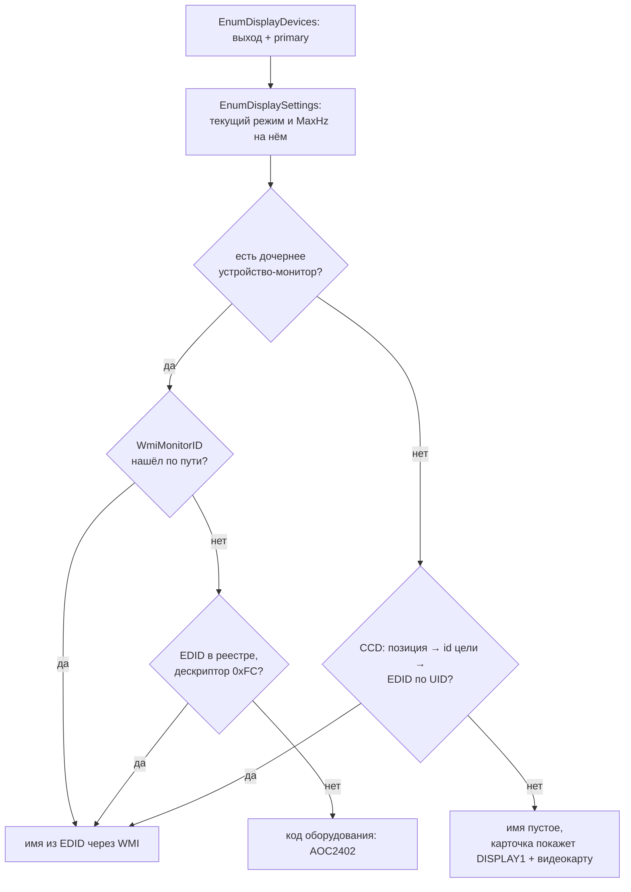

# Снимок железа

`PcDiagSnapshotService.Take(gtaPath?)` собирает одну структуру `PcSnapshot` - всё, что диагностике нужно знать о машине: процессор, планки памяти и свободные слоты, диски с типом носителя, видеокарты с реальным объёмом VRAM, схему питания, мониторы, службы, автозагрузку, фоновые процессы, флаги загрузчика. Дальше снимок уходит в `PcDiagRules.Evaluate` и превращается в список находок, а сам снимок остаётся неизменным - движок правил ничего не дочитывает с машины.

Два требования держат всю архитектуру этого файла. Первое: **только чтение**. Ни одной записи в реестр, ни одной команды, которая что-то меняет. Второе: **снимок обязан получиться всегда**. WMI на живых машинах ломается регулярно - битый репозиторий CIM, урезанная сборка Windows без половины классов, отсутствие прав. Отчёт, который падает целиком из-за одного отказавшего датчика, бесполезен: люди приходят в диагностику как раз с поломанных машин.

Отсюда 26 независимо обёрнутых сборщиков и словарь `CollectorErrors`, в котором лежит имя каждого упавшего вместе с его сообщением.

## Только чтение

Источников всего четыре, и все они read-only:

- WMI: только `SELECT`-запросы, ни одного `Put()` или вызова метода класса.
- Реестр: `OpenSubKey` без перегрузки с `writable: true`, то есть ключ открывается на чтение.
- `powercfg /getactivescheme` и `powercfg /getacvalueindex` - обе команды только печатают.
- `bcdedit /enum {current}` - перечисление, без `/set`.

Изменения живут в отдельном классе `PcDiagApplier`, и туда попадает только то, что правило пометило `AutoFixable`. Он делает точку восстановления перед первым твиком и пишет в журнал ПРЕЖНЕЕ состояние каждого ключа. Снимок и применение не пересекаются нигде: `Take` можно вызывать сколько угодно раз, машина от этого не меняется.

Побочный эффект того же принципа: снимок не требует прав администратора. Из-под обычного процесса просто отвалится часть сборщиков (`bcd` - точно, `game` - в части исключений Defender), и это видно в отчёте.

## 26 сборщиков, каждый в своей обёртке

`Take` - плоский список вызовов. Один сборщик = одна строка, одно имя, одна точка отказа:

```cs title="MiamiGraphics.Core/PcDiag/PcDiagSnapshotService.cs:19"
public static PcSnapshot Take(string? gtaPath = null)
{
    var errors = new Dictionary<string, string>(StringComparer.Ordinal);

    var cpu = Collect(errors, "cpu", CollectCpu);
    var ram = Collect(errors, "ram", CollectRam) ?? new List<RamStickInfo>();
    var ramSlots = Collect(errors, "ramSlots", () => MemorySlots().Count);
    var totalRam = Collect(errors, "ramTotal", CollectTotalRam);
    var disks = Collect(errors, "disks", CollectDisks) ?? new List<DiskInfo>();
    // ... ещё 20 строк
    var game = gtaPath is null ? null : Collect(errors, "game", () => CollectGame(gtaPath));
    // ...
    return new PcSnapshot(/* ... */, CollectorErrors: errors);
}
```

Обёртка - три перегрузки одного метода, по одной на форму результата. Разница только в том, что вернуть вместо упавшего значения:

```cs title="MiamiGraphics.Core/PcDiag/PcDiagSnapshotService.cs:81"
private static T? Collect<T>(Dictionary<string, string> errors, string name, Func<T> collector)
    where T : class
{
    try { return collector(); }
    catch (Exception ex) { errors[name] = ex.Message; return null; }
}

private static long Collect(Dictionary<string, string> errors, string name, Func<long> collector)
{
    try { return collector(); }
    catch (Exception ex) { errors[name] = ex.Message; return 0; }
}

private static bool Collect(Dictionary<string, string> errors, string name, Func<bool> collector)
{
    try { return collector(); }
    catch (Exception ex) { errors[name] = ex.Message; return false; }
}
```

Значение по умолчанию выбрано так, чтобы правила не могли принять отказ за находку: список пустой (`?? new List<>()` на месте вызова), объект `null`, число 0, флаг `false`. Правило, которое видит `s.Display is null` или `s.RamSticks.Count == 0`, просто молчит - оно не заявляет «монитора нет» и «памяти нет».

Полный список сборщиков и их источников:

| ключ | источник | что читаем |
|---|---|---|
| `cpu` | `Win32_Processor` | имя, ядра, потоки, `MaxClockSpeed`, `L3CacheSize` |
| `ram` | `Win32_PhysicalMemory` + SMBIOS | объём, `Speed`, `ConfiguredClockSpeed`, `SMBIOSMemoryType` |
| `ramSlots` | SMBIOS, структуры типа 17 | сколько слотов на плате всего, включая пустые |
| `ramTotal` | `Win32_ComputerSystem` | `TotalPhysicalMemory` |
| `disks` | `MSFT_PhysicalDisk` в `root\microsoft\windows\storage` | модель, `MediaType`, `BusType`, размер |
| `gpus` | `Win32_VideoController` + класс видеоадаптеров в реестре | имя, версия и дата драйвера, `qwMemorySize` |
| `power` | `powercfg /getactivescheme` | GUID и локализованное имя активной схемы |
| `security` | `Win32_DeviceGuard` в `root\Microsoft\Windows\DeviceGuard` | VBS (статус 2), HVCI (сервис 2 среди работающих) |
| `gameDvr` | HKCU | `GameDVR_Enabled`, `AppCaptureEnabled` |
| `os` | `Win32_OperatingSystem` | `Caption`, `Version` |
| `battery` | `Win32_Battery` | есть батарея или нет (ноутбук) |
| `services` | `Win32_Service` | 3 службы: `SysMain`, `WSearch`, `EventLog` |
| `autostart` | Run-ключи HKCU, HKLM, WOW6432Node | имя и команда каждой строки |
| `processes` | `Process.GetProcesses` | 11 групп фона, счёт и суммарный WorkingSet группы |
| `display` | `EnumDisplaySettingsW` | режим основного экрана и максимум герц на нём |
| `monitors` | `EnumDisplayDevicesW` + `WmiMonitorID` + EDID + CCD | все подключённые экраны с именами |
| `network` | `Win32_NetworkAdapter WHERE NetConnectionStatus = 2` | провод, Wi-Fi, туннель (12 маркеров имён) |
| `pagefile` | `Win32_ComputerSystem` + `Win32_PageFileUsage` | `AutomaticManagedPagefile`, `AllocatedBaseSize` |
| `winFeatures` | реестр | `HwSchMode` (HAGS), `AutoGameModeEnabled`, `EnableTransparency` |
| `bcd` | `bcdedit /enum {current}` | `useplatformclock`, `disabledynamictick` |
| `game` | `MSFT_Partition` + `MSFT_PhysicalDisk` + ключ Defender | носитель раздела с игрой, исключения антивируса |
| `antivirus` | `AntiVirusProduct` в `root\SecurityCenter2` | `displayName` зарегистрированных продуктов |
| `prefetch` | `PrefetchParameters` | `EnablePrefetcher`, `EnableSuperfetch` |
| `gameProcess` | `Process.GetProcessesByName` | приоритет и маска аффинити `GTA5` / `GTA5_Enhanced` |
| `powerDetails` | `powercfg /getacvalueindex` | `PROCTHROTTLEMIN`, USB selective suspend, PCIe ASPM |
| `visualFx` | `Explorer\VisualEffects` | `VisualFXSetting` (0 - решает Windows, 1 - вид, 2 - производительность, 3 - особые) |

Сборщик `game` вызывается только когда путь к игре передан вызывающим кодом (его находит [`HardwareLocator`](../paths/gta-detection.md)). Без пути он не падает и не пишет ошибку - он просто не запускается, и в снимке 25 сборщиков вместо 26.

Оба внешних процесса запускаются с `RedirectStandardOutput`, `CreateNoWindow` и `WaitForExit(5000)`. Вывод обоих локализован, поэтому парсим не текст, а форму: GUID схемы ловим регулярным выражением, значения `bcdedit` - по имени параметра, `powercfg /getacvalueindex` - по `0x%x`. Кодировку задаём явно: консольные утилиты пишут в OEM-кодировке (у русской Windows 866), без `StandardOutputEncoding` имя схемы приходит кракозябрами. Провайдер кодовых страниц регистрируем сами - модуль не должен рассчитывать, что это сделал хост.

## Что видно, когда сборщик упал

В отчёт для интерфейса уезжают только **ключи** упавших сборщиков, не сообщения:

```cs title="MiamiGraphics.Shell/Bridge/AppBridge.cs"
SensorErrors: snap.CollectorErrors.Keys.ToList(),
Findings: findingDtos,
ElapsedMs: sw.ElapsedMilliseconds);
```

Сообщение исключения остаётся внутри снимка: оно нужно при разборе, но в карточку не годится - там текст вида `Not supported` или трассировка провайдера WMI. Карточка по ключу пишет «не удалось прочитать» на языке интерфейса.

## Слоты памяти: сырой SMBIOS вместо Win32_PhysicalMemory

### Чем не хватило WMI

`Win32_PhysicalMemory` перечисляет только **занятые** слоты. Из него нельзя ответить на вопрос, ради которого карточка памяти вообще существует: есть ли куда доставить планку. Две планки по 8 ГБ в четырёхслотовой плате и две планки по 8 ГБ в двухслотовой - это два разных совета, а WMI отдаёт одинаковые данные.

Второе: `DeviceLocator` у WMI - то, что написал производитель платы, и оно не обязано быть уникальным. На тестовой машине обе планки имеют локатор `DIMM 1` и различаются только банком (каналом). Карточка честно печатала `DIMM 1` дважды, и понять, в какие физические слоты воткнута память, было невозможно.

### Структуры типа 17

Полная таблица SMBIOS отдаётся классом `MSSmBios_RawSMBiosTables` в пространстве `root\wmi` одним блобом. Слоты памяти в ней - структуры типа 17 (Memory Device), по одной на слот, включая пустые.

```cs title="MiamiGraphics.Core/PcDiag/PcDiagSnapshotService.cs:199"
if (type == 17 && len >= 0x15)
{
    string At(int idx) => idx > 0 && idx <= strings.Count ? strings[idx - 1].Trim() : "";
    var size = BitConverter.ToUInt16(data, i + 0x0C);
    found.Add((At(data[i + 0x11]), At(data[i + 0x10]), size != 0));
}

if (type == 127) break;
i = p;
```

Разбор идёт по общим правилам SMBIOS: у каждой структуры первый байт - тип, второй - длина формальной части, дальше сразу за формальной частью лежит набор C-строк, и весь блок кончается двумя нулевыми байтами подряд. Поля внутри структуры - индексы в этот набор, не сами строки.

| смещение | поле |
|---|---|
| `0x00` | тип структуры (17 - Memory Device, 127 - конец таблицы) |
| `0x01` | длина формальной части, нам нужно `>= 0x15` |
| `0x0C` | размер модуля, `UInt16`; **0 = слот пустой** |
| `0x10` | индекс строки локатора устройства (`DIMM 1`) |
| `0x11` | индекс строки банка (`P0 CHANNEL A`) |

Пустая структура без строк (два нуля сразу за формальной частью) обрабатывается отдельной веткой - иначе разбор ушёл бы за границу блока.

### Как из этого получается «A2»

Имени слота, каким оно подписано на плате, в таблице нет. Оно выводится: буква канала плюс порядковый номер локатора внутри этого канала.

```cs title="MiamiGraphics.Core/PcDiag/PcDiagSnapshotService.cs:152"
static string Letter(string bank, string locator)
{
    var m = Regex.Match(bank, @"CHANNEL\s*([A-Z])", RegexOptions.IgnoreCase);
    if (m.Success) return m.Groups[1].Value.ToUpperInvariant();
    m = Regex.Match(locator, @"([A-Z])\s*\d", RegexOptions.IgnoreCase);
    return m.Success ? m.Groups[1].Value.ToUpperInvariant() : "";
}

foreach (var group in slots.GroupBy(x => Letter(x.Bank, x.Locator)))
{
    var ordered = group.OrderBy(x => Number(x.Locator)).ToList();
    for (int i = 0; i < ordered.Count; i++)
    {
        var (bank, locator, populated) = ordered[i];
        var name = group.Key.Length > 0 ? group.Key + (i + 1) : locator;
        result.Add(new MemorySlot(bank, locator, name, populated));
    }
}
```

Буква берётся из банка (`P0 CHANNEL A`), а если банк её не содержит - из локатора (`DIMM A1`, так подписывает часть плат Intel). Номер - хвостовые цифры локатора; сортируем по нему внутри канала и нумеруем с единицы. Нумерация выводится из порядка, а не из числа в локаторе, потому что часть плат нумерует слоты внутри канала с нуля:

| Банк | Локатор | Размер | Имя слота |
|---|---|---|---|
| `P0 CHANNEL A` | `DIMM 0` | 0 | `A1` |
| `P0 CHANNEL A` | `DIMM 1` | 16 ГБ | `A2` |
| `P0 CHANNEL B` | `DIMM 0` | 0 | `B1` |
| `P0 CHANNEL B` | `DIMM 1` | 16 ГБ | `B2` |

`RamSlotsTotal` для такой машины - 4, планки стоят в `A2` и `B2`, свободны `A1` и `B1`. Это ровно то, что видно, если открыть крышку.

### Если сырую таблицу не отдали

`MemorySlots` глотает своё исключение и возвращает пустой список: без сырой таблицы имён слотов не будет, но планки-то WMI перечислил. Тогда `SlotName` пустой, а подпись собирает интерфейс из того, что есть:

```cs title="MiamiGraphics.Shell/Bridge/AppBridge.cs:22631"
private static string RamSlotLabel(string bankLabel, string deviceLocator)
{
    // ...
    if (letter.Length > 0 && locator.Length > 0) return letter + " · " + locator;
    if (locator.Length > 0) return locator;
    if (bank.Length > 0) return bank;
    return "?";
}
```

Отдельный ключ `ramSlots` при этом даст 0 - «сколько всего слотов, не знаем», и правило про апгрейд промолчит.

## Мониторы с настоящими именами

### Почему три источника

Ни один API не отдаёт всё нужное сразу:

- `EnumDisplayDevicesW(null, i, ...)` перечисляет выходы адаптера (`\\.\DISPLAY1`), говорит, какой основной, и даёт имя видеокарты в `DeviceString`.
- `EnumDisplaySettingsW(deviceName, ...)` по имени выхода отдаёт текущий режим, а перебором всех режимов - максимальную герцовку **на текущем разрешении** (не вообще: 144 Гц на 1920×1080 и 60 Гц на 3840×2160 - разные строки одного списка).
- Имени монитора нет ни там, ни там. Второй проход `EnumDisplayDevicesW(deviceName, 0, ...)` даёт дочернее устройство-монитор, но его `DeviceString` практически всегда `Generic PnP Monitor`. Настоящее имя лежит в EDID.

### Сшивка выхода и WMI

Имена берём из `WmiMonitorID` в `root\wmi`. `UserFriendlyName` и `ManufacturerName` там - массивы `ushort` с нулевым хвостом, их разворачивает `FromCharArray`; вендор приклеивается к модели, только если модель с него не начинается (иначе выходит `AOC AOC 24G2W1G4`).

Сшиваются два источника через путь устройства, и в лоб они не совпадают:

```
выход (DeviceID)   DISPLAY#AOC2402#5&2a2d0e9&0&UID4353#{guid}
WMI (InstanceName) DISPLAY\AOC2402\5&2a2d0e9&0&UID4353_0
```

Разные разделители, у WMI ещё и хвост `_0`. Поэтому обе строки прогоняются через `Squash` - остаются только буквы и цифры в нижнем регистре - и сравниваются вхождением подстроки.

### Откат 1: EDID из реестра

`WmiMonitorID` есть не везде. На части машин класс отвечает `Not supported`, и без отката оба экрана остались бы без имён. Тот же EDID кладёт в реестр сам PnP-стек при подключении монитора, так что путь интерфейса разбирается на код оборудования и экземпляр, а по ним открывается ключ устройства:

```cs title="MiamiGraphics.Core/PcDiag/PcDiagSnapshotService.cs:686"
var parts = interfacePath!.Split('#');
var hardwareId = parts[1];      // AOC2402
var instance = parts[2];        // 5&2a2d0e9&0&UID4353

using var key = Registry.LocalMachine.OpenSubKey(
    $@"SYSTEM\CurrentControlSet\Enum\DISPLAY\{hardwareId}\{instance}\Device Parameters");
if (key?.GetValue("EDID") is byte[] edid && edid.Length >= 126)
{
    for (int offset = 54; offset + 18 <= 126; offset += 18)
    {
        if (edid[offset] != 0 || edid[offset + 1] != 0 || edid[offset + 2] != 0) continue;
        if (edid[offset + 3] != 0xFC) continue;
        // ... текст до 0x0A
    }
}
return hardwareId.Trim();
```

Разбор блока EDID:

| смещение | что там |
|---|---|
| 54, 72, 90, 108 | четыре дескриптора по 18 байт |
| `+0 … +2` | три нуля - признак текстового дескриптора, а не тайминга |
| `+3` | тип дескриптора: `0xFC` - имя монитора, всё остальное пропускаем |
| `+5 … +17` | до 13 символов имени, обрыв на `0x0A` или `0x00` |

Дескриптора с именем может не быть вовсе - тогда возвращаем код оборудования (`AOC2402`). Это всё ещё человечнее, чем `Generic PnP Monitor`.

### Откат 2: через CCD по позиции экрана

Бывает, что дочернего устройства-монитора нет в принципе: виртуальные экраны стриминга, заглушки HDMI, KVM. Брать EDID неоткуда - у выхода просто нет монитора в дереве устройств. Остаётся `QueryDisplayConfig` с флагом «только активные пути»: он даёт id цели, а имя экземпляра монитора в реестре кончается на тот же UID (`UID4357` → `GIGABYTE G24F`).

Связать выход с целью «в лоб» умеет `DisplayConfigGetDeviceName`, но на урезанных сборках Windows этого экспорта в `user32` нет - проверено 22.08.2026: `GetProcAddress` возвращает 0, при том что `QueryDisplayConfig` на месте. Поэтому ключом стала позиция экрана на рабочем столе: она уникальна по определению (два активных экрана не могут занимать один угол), и ту же позицию отдаёт `EnumDisplaySettingsW` в `dmPositionX`/`dmPositionY`.

```cs title="MiamiGraphics.Core/PcDiag/PcDiagSnapshotService.cs:722"
for (int i = 0; i < nPaths; i++)
{
    var idx = paths[i].sourceInfo.modeInfoIdx;
    if (idx >= nModes) continue;
    var mode = modes[idx];
    if (mode.infoType != DisplayConfigSourceMode) continue;
    map[(mode.info.sourceMode.position.x, mode.info.sourceMode.position.y)] = paths[i].targetInfo.id;
}
```

`DISPLAYCONFIG_MODE_INFO` содержит объединение `targetMode`/`sourceMode`; нам нужен только `sourceMode`, но объявлять блок приходится размером в 48 байт - по самому большому члену, иначе разъедется раскладка всего массива.

### Порядок попыток



Последняя ветка - осознанный выбор. Подписать монитор словами `Generic PnP Monitor` ничем не лучше, чем не подписать: в карточке остаются имя выхода и видеокарта, которая его тянет, а этого хватает, чтобы ответить «сколько у меня экранов и какие». Основной монитор ставится в списке первым - `OrderByDescending(m => m.IsPrimary)`.

## Числа, которые из снимка читают правила

Движок правил сам ничего не измеряет - он сравнивает поля снимка с порогами. Те, что зависят от разобранного выше:

| находка | условие | эффект |
|---|---|---|
| `ram-xmp-off` | `ConfiguredMt < RatedMt - 132` | 10-25% кадров |
| `ram-jedec-speed` | все планки DDR4 (тип 26) `<= 2666` МТ/с либо DDR5 (тип 34) `< 4800` МТ/с | Minor |
| `ram-single-channel` | одна планка, либо все планки в одном канале | 10-30% кадров |
| `display-not-max-hz` | `MaxHz >= CurrentHz + 20` | Major, чинится автоматически |

Допуск 132 МТ/с у `ram-xmp-off` отсекает округления SPD: паспортные 3200 против фактических 3199 - это не выключенный профиль, а разное округление одного и того же значения в двух полях WMI.

## Границы снимка

- Снимок статический. Никаких замеров под нагрузкой, температур и счётчиков производительности - только то, что можно прочитать один раз и мгновенно.
- `gameProcess` заполняется, только если игра запущена в момент снимка. Если процесс есть, но прав на чтение приоритета нет, в поле `PriorityClass` уезжает `недоступно: <сообщение>`, а не молчание.
- `InDefenderExclusions` - трёхзначное поле: `true`, `false` и `null`. `null` означает «ключ исключений недоступен», и правило по нему не срабатывает: отсутствие данных не равно «исключения нет».
- `AdapterRAM` из WMI не используется вовсе - это `uint32`, и всё, что больше 4 ГБ, он показывает неверно. VRAM читается из `HardwareInformation.qwMemorySize` в классе видеоадаптеров и сопоставляется с контроллером по `DriverDesc`.
