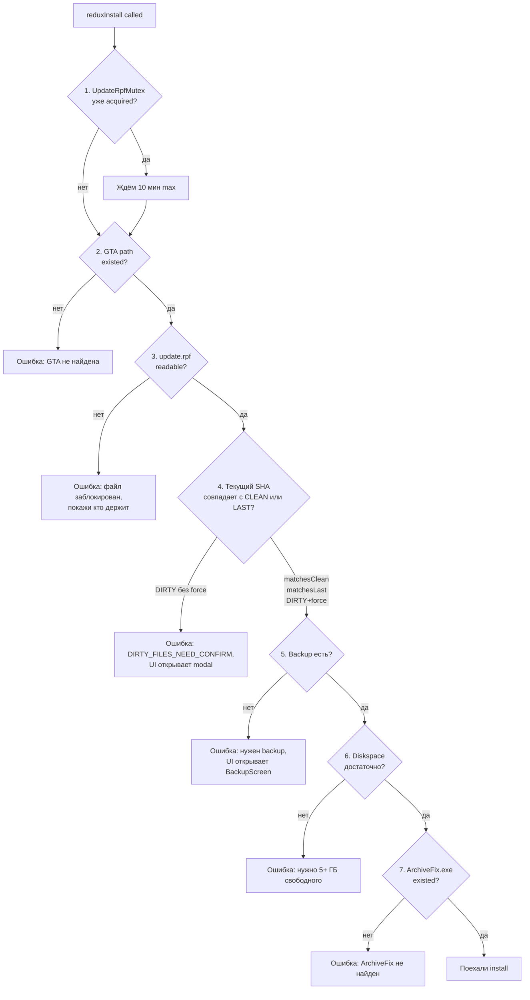

# Гарды перед инжектом

Прежде чем тронуть `update.rpf`, install pipeline проходит **серию проверок**. Если любая не прошла - install прерывается с понятной ошибкой.

## Список гардов в порядке



## Гард 1: Mutex

```cs
using var _mtx = await UpdateRpfMutex.AcquireAsync($"redux-install:{reduxId}");
```

Не **проверка** в строгом смысле - а **lock** на shared resource. Если другой install уже идёт - ждём 10 минут, потом throw'аем TimeoutException.

UI на это ловит - показывает «другой мод устанавливается». Юзер не может запустить два install параллельно.

## Гард 2: GTA path

```cs
var gtaRoot = await GetGtaPathAsync();
if (string.IsNullOrWhiteSpace(gtaRoot) || !Directory.Exists(gtaRoot))
{
    EmitInstallProgress(reduxId, displayName, "error", 0, "GTA не найдена.");
    return new InjectResultDto(false, "GTA не найдена. Укажи путь в Admin → Settings → Paths.", null);
}
```

Юзер мог:

- Удалить GTA после первого setup'а Miami;
- Переименовать папку GTA;
- Сменить hard drive (GTA теперь на D:\ вместо C:\, settings всё ещё указывает на C:\).

В любом случае - ошибка с указанием куда полезть Settings.

## Гард 3: File readable

```cs
var updateRpf = Path.Combine(gtaRoot, "update", "update.rpf");
if (!File.Exists(updateRpf))
{
    return new InjectResultDto(false, "update.rpf отсутствует в GTA-папке. Verify integrity через Rockstar Launcher.", null);
}

try
{
    using var probe = File.Open(updateRpf, FileMode.Open, FileAccess.Read, FileShare.Read);
}
catch (IOException)
{
    var lockers = FileLockDetector.WhoIsLocking(updateRpf);
    return new InjectResultDto(false,
        $"update.rpf занят. Закрой: {string.Join(", ", lockers.Select(l => l.ProcessName))}",
        null);
}
```

GTA может быть запущена. Rockstar Launcher делает auto-verify файлов в фоне. Антивирус скан'ит. Любой из них держит `update.rpf` в shared read mode, но **не** в shared write - мы не можем писать.

[FileLockDetector](../backup/pipeline.md#filelockdetector) даёт список процессов. UI показывает modal «закрой эти программы и попробуй снова».

## Гард 4: Preflight (CLEAN / LAST / DIRTY)

[Уже описано детально](../inject/preflight.md). Главное:

- `matchesClean` - ОК сразу.
- `matchesLast` - auto-restore clean → ОК.
- `DIRTY` + `force=false` - error `DIRTY_FILES_NEED_CONFIRM`. UI открывает 3-way modal (Preserve / Force / Cancel).
- `DIRTY` + `force=true` - юзер согласился перетереть → restore-clean → ОК.

## Гард 5: Backup ready

Если **clean** копия отсутствует у нас (например юзер впервые запустил Miami) - install не может работать. Нужен backup.

```cs
var backupStatus = await _backupService.GetStatusAsync(gtaRoot, CancellationToken.None);
if (!backupStatus.CleanUpdatePresent)
{
    return new InjectResultDto(false, "BACKUP_REQUIRED", null);
}
```

UI на это ловит - открывает BackupScreen. Юзер видит wizard «сначала забэкапим твой update.rpf, потом сможем ставить моды».

После успешного backup - autoredirect на ту же install operation.

## Гард 6: Diskspace

```cs
var driveInfo = new DriveInfo(Path.GetPathRoot(updateRpf)!);
const long REQUIRED_FREE = 5L * 1024 * 1024 * 1024;   // 5 ГБ
if (driveInfo.AvailableFreeSpace < REQUIRED_FREE)
{
    return new InjectResultDto(false,
        $"На диске {driveInfo.Name} осталось мало места ({driveInfo.AvailableFreeSpace / 1024 / 1024} МБ). " +
        $"Нужно минимум 5 ГБ для безопасного install'а.",
        null);
}
```

5 ГБ потому что:

- 2 ГБ - снапшот `.preinstall`;
- 2 ГБ - новый `update.rpf.hnt_temp` во время Smart Rebuild;
- 200-400 МБ - `patch.zip` downloaded;
- 200 МБ - распакованный `patch_files/`;
- Запас.

Если меньше 5 ГБ - Smart Rebuild может **частично** записать новый файл и **не довести** до конца. Юзер получит crash GTA. Лучше **отказать** до начала.

## Гард 7: ArchiveFix presence

```cs
var archiveFixPath = ResolveArchiveFixPath();
if (!File.Exists(archiveFixPath))
{
    return new InjectResultDto(false,
        "ArchiveFix.exe не найден. Переустанови Miami Graphics - этот файл должен лежать в additionals\\.",
        null);
}
```

Без [ArchiveFix](../rpf/archivefix.md) - Smart Rebuild соберёт RPF, но GTA отбросит файл как corrupted. Лучше **не** начинать install чем оставить юзера с битым `update.rpf`.

Если файл отсутствует - это значит юзер: либо вручную удалил `additionals/`, либо anti-virus поставил в карантин, либо install Miami был incomplete. UI говорит «переустанови Miami».

## После всех гардов

Если все 7 прошли - **поехали** install:

1. [Snapshot](../inject/rollback.md) `update.rpf` → `.preinstall`.
2. [Restore clean](../inject/preflight.md) если matchesLast или DIRTY+force.
3. [Download patch.zip](../inject/pipeline.md#3-download-patchzip).
4. [Smart Rebuild](../inject/smart-rebuild.md).
5. [ArchiveFix](../rpf/archivefix.md).
6. Save install_state.json.

Если **любой** из этих шагов упал - [TryRollbackAsync](../inject/rollback.md) восстанавливает `.preinstall`.

## Что мы НЕ проверяем

- **Antivirus presence** - нет надёжного API чтобы понять «Антивирус сейчас сканирует наш файл». Просто пробуем write и обрабатываем `IOException`.
- **GTA version compatibility** - мы устанавливаем мод **независимо** от того target_gta_version. UI показывает warning если версии расходятся, но не блокирует. Юзер сам решает.
- **Network connectivity** перед download - пробуем download, если упал - error. Нет смысла probe-ить до того.

## Failure mode таблица

| Гард | Что увидит юзер |
|---|---|
| Mutex timeout | Toast «другой мод устанавливается, подожди» |
| GTA не найдена | Toast + кнопка «открыть Settings» |
| Файл заблокирован | Modal со списком процессов + кнопка «закрыть все» |
| DIRTY без force | 3-way modal preserve / force / cancel |
| Backup required | Auto-redirect на BackupScreen wizard |
| Недостаточно места | Toast с конкретным free space, без auto-fix |
| ArchiveFix missing | Toast «переустанови Miami» |

[Дальше: что будет если не пройти →](failure-modes.md)
