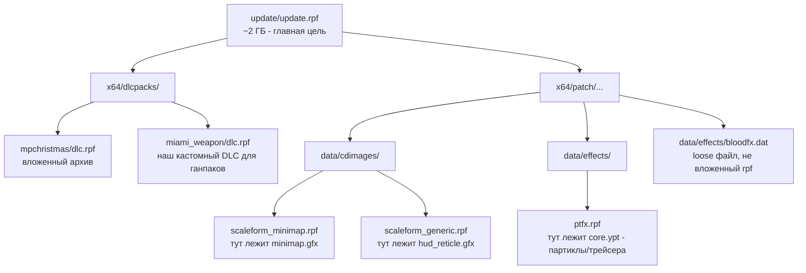

# Обзор RPF8

RPF (RAGE Package File) - формат архивов движка RAGE. У GTA V версия 8 - `RPF7` в коде, но финальная ревизия этой версии. Не путать с `RPF7` ранних GTA IV билдов, формат разный по шифрованию и хешированию.

Внутри игры RPF используется для **всего** - ресурсов уровня, машин, оружия, текстур, скриптов, аудио, шрифтов. Структурно ближе всего к ZIP или TAR - это контейнер с TOC шапкой плюс блобы файлов друг за другом. Отличия:

- Шифрование на уровне файлов (AES для конфигов, NG для ресурсов).
- Поддержка вложенных архивов как обычных файлов (`.rpf` внутри `.rpf` - без распаковки в память).
- Файлы-«ресурсы» (`.ydr`/`.ydd`/`.ytd`/`.yft`/`.ypt`) имеют второй уровень формата: RSC7 header + virtual/physical page tables.

## Какие RPF мы трогаем



Главный наш target - `update/update.rpf`. Это файл который Rockstar обновляет с каждым патчем игры, и который RP-сервера разрешают модифицировать (только этот, не `x64a.rpf` или другие том-архивы - те античит проверяет жёстче).

Внутри `update.rpf` интересные нам подархивы:

| Подархив | Что внутри | Какой компонент |
|---|---|---|
| `x64/patch/data/cdimages/scaleform_minimap.rpf` | `minimap.gfx` - флэш-вектор миникарты | Минимапа |
| `x64/patch/data/cdimages/scaleform_generic.rpf` | `hud_reticle.gfx` - прицел и HUD | Прицел (crosshair) |
| `x64/patch/data/effects/ptfx.rpf` | `core.ypt` - все партикл-эффекты включая трейсера | Трейсера, blood, искры |
| `x64/patch/common/data/effects/bloodfx.dat` | конфиг blood эффектов (loose-файл, не в rpf) | bloodfx |
| `x64/patch/common/data/timecycle/*.xml` + `visualsettings.dat` | таймциклы / погода | Timecycle |
| `x64/dlcpacks/miami_weapon/dlc.rpf` | наш DLC для оружейных модов | Ганпаки |

Видно как структура диктует архитектуру парсера. Каждый компонент имеет известное место - [`ComponentScanner`](../parser/what-we-extract.md) ходит по этим путям и проверяет: тут что-то лежит у донора → считаем что мод трогает этот компонент.

## Что мы НЕ трогаем

- `x64a.rpf`, `x64b.rpf` ... `x64w.rpf` - основные том-архивы игры. Размеры от 1 до 13 ГБ каждый. Античит проверяет хеш. Менять их = бан.
- `common.rpf`, `script.rpf` - игровая логика. Никогда.
- `audio/*.rpf` кроме `x64/audio/sfx/` - звуковые том-архивы. Их мы используем только для **звуковых паков**, в очень ограниченной области (`PLAYER.rpf`, `RESIDENT.rpf` и пара других внутри `sfx/`).

## Краткая шапка RPF8

```
struct RpfHeader_v8 {
  uint32 magic;          // 'RPF7' (0x37465052)
  int32  entryCount;     // сколько записей в TOC
  int32  namesLength;    // длина блока имён
  int32  encryption;     // 0=NONE, 0x4E45504F=OPEN, 0x0FFFFFF9=AES, 0x0FEFFFFF=NG
}
struct RpfEntry {           // 16 байт
  uint32 nameOffset;        // offset в name table
  uint32 flags;             // первые 8 бит = тип записи
  // ... type-specific поля
}
```

Магия `0x37465052` = `'7FPR'` little-endian = "RPF7". Имена файлов хранятся отдельным блоком после TOC. Файлы лежат подряд с offset'ами заданными в TOC.

Дальше - детально:

- [Структура архива →](archive-structure.md) (TOC, имена, file entries)
- [Шифрование AES + NG →](encryption.md) (101 ключ, табличный шифр)
- [RageLib.GTA5 - наш API →](ragelib.md) (что используем, что обходим)
- [ArchiveFix.exe - пересчёт хешей →](archivefix.md) (без него файл невалидный)
