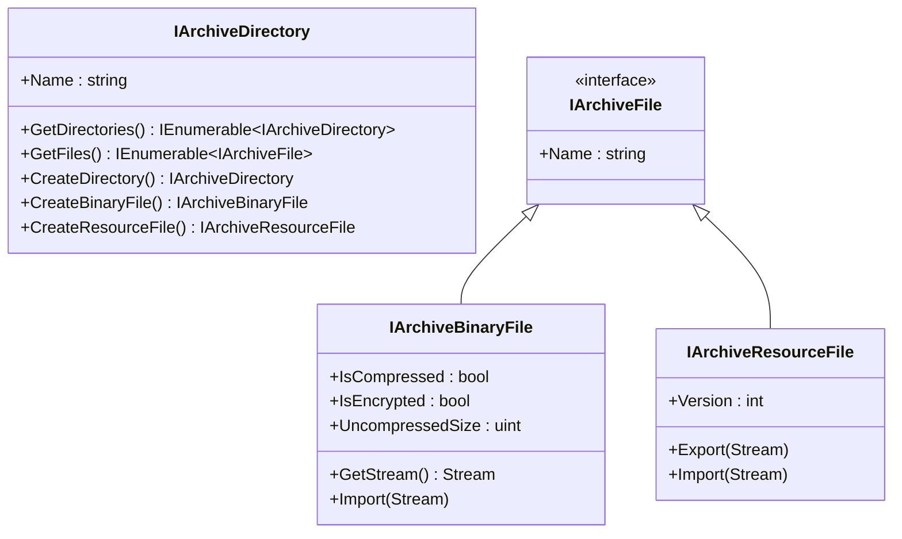

# RageLib.GTA5 - наш API к формату

[RageLib](https://github.com/Neodymium146/gta-toolkit) - open-source .NET библиотека для чтения и записи GTA RPF архивов. Изначально часть toolkit'а Neodymium. У нас живёт **форк** в виде двух проектов: `RageLib` (core) и `RageLib.GTA5` (специфичные для V5 ключи и crypto-механика).

Зачем форк - нужно было поправить пару edge-cases которые в апстриме не правились (медленный flush через intermediate `MemoryStream` на больших архивах, специфика encryption flag inheritance для вложенных RPF), и не хотелось зависеть от чужого Git'а в build pipeline.

## Главный API

Открыть архив:

```cs
using var archive = RageArchiveWrapper7.Open(filePath);
// или из stream'а (для вложенных rpf)
using var nested = RageArchiveWrapper7.Open(parentStream, name);
```

Создать новый:

```cs
using var dest = RageArchiveWrapper7.Create(outputPath);
// или
using var dest = RageArchiveWrapper7.Create(parentStream, name);
```

Прочитать содержимое корня:

```cs
foreach (var dir in archive.Root.GetDirectories())  { /* ... */ }
foreach (var file in archive.Root.GetFiles())       { /* ... */ }
```

Записать файл в новый архив:

```cs
var newF = destDir.CreateBinaryFile();
newF.Name = "minimap.gfx";
newF.IsCompressed = true;
newF.IsEncrypted = false;
newF.UncompressedSize = (uint)data.Length;
newF.Import(new MemoryStream(compressedData));
```

Сохранить:

```cs
dest.FileName = "update.rpf";
dest.archive_.Encryption = ...;   // обязательно
dest.Flush();
dest.Dispose();
```

## Иерархия типов



`IArchiveBinaryFile` - обычный блоб. `IArchiveResourceFile` - старый формат resource-файлов из GTA IV, в GTA V не используется напрямую (все ресурсы хранятся как `BinaryFile` с внутренним RSC7).

## Resource vs Binary в коде

RSC7 ресурсы (`.ydr`, `.ydd`, `.yft`, `.ytd`, `.ypt`) **по структуре RPF** записаны как `BinaryFile`. Их «ресурсность» определяется по сигнатуре первых байт самого файла:

```cs title="MiamiGraphics.Core/Injector/RpfInjectEngine.cs:289"
bool isRsc7Resource =
    rawData.Length >= 4 &&
    rawData[0] == 0x52 &&  // 'R'
    rawData[1] == 0x53 &&  // 'S'
    rawData[2] == 0x43;    // 'C'

if (isRsc7Resource)
{
    var newF = dir.CreateResourceFile();
    newF.Name = name;
    newF.Import(new MemoryStream(rawData));
}
else
{
    var newF = dir.CreateBinaryFile();
    // ...
}
```

Зачем - RageLib имеет отдельный код-путь для `ResourceFile.Import`, который **не** сжимает контент DEFLATE'ом (RSC7 уже внутренне сжатый), но добавляет правильные метаданные в TOC чтобы игра распознала это как ресурс. Если зальём `.ydr` как `BinaryFile` + `DeflateStream`, размер вырастет (double compression) и игра отбросит файл при загрузке.

## Compression policy

Для не-ресурсных файлов сжимаем всегда **DEFLATE**, кроме случаев когда:

- файл это вложенный `.rpf` (Rockstar их хранит без compression - поверх своей внутренней компрессии);
- оригинальный файл которого мы заменяем был uncompressed (наследуем - некоторые ассеты Rockstar держат raw для random-access).

```cs title="MiamiGraphics.Core/Injector/RpfInjectEngine.cs:301"
bool shouldCompress = !name.EndsWith(".rpf", StringComparison.OrdinalIgnoreCase);
if (oldBinTemplate != null && !oldBinTemplate.IsCompressed) shouldCompress = false;

if (shouldCompress)
{
    using (var ms = new MemoryStream())
    {
        using (var def = new DeflateStream(ms, CompressionMode.Compress, true))
            def.Write(rawData, 0, rawData.Length);
        newF.UncompressedSize = (uint)rawData.Length;
        rawData = ms.ToArray();
        newF.IsCompressed = true;
    }
}
```

Это даёт нам ~30% уменьшения размера файла внутри RPF. Опытным путём - `update.rpf` после нашего инжекта весит примерно столько же, сколько оригинал, разница в основном в добавленных файлах от мода.

## Чего RageLib не умеет

| Что | Альтернатива |
|---|---|
| Удалять файлы из существующего архива «inplace» | [Smart Rebuild](../inject/smart-rebuild.md) - копируем всё кроме удаляемого в новый архив |
| Изменять файл в существующем архиве | То же - пересоздаём архив целиком |
| Считать checksum полей TOC после правок | [ArchiveFix.exe](archivefix.md) - внешний нативный fixup |
| Перекодировать ресурсы между версиями RSC7 | Не нужно - все наши ресурсы одной версии |
| Конвертировать `.ydr` → `.gltf` | Делает [CodeWalker](../history/codewalker.md) - пробовали, [не подошло](../history/codewalker.md) |

Первые два - фундаментальное ограничение формата RPF. TOC шапки лежит в начале файла, file offsets там абсолютные. Удалить файл = либо оставить дырку (TOC ссылается на дырку, размер архива не меняется), либо пересобрать всё. Изменить файл с другим размером - то же самое.

[Это была главная боль](../history/ragelib-v1.md) в первой попытке. Решение пришло через [полный rebuild всего архива на каждый install](../history/ragelib-v2.md) - звучит дорого, но при правильной потоковой реализации на NVMe это 6 секунд для 2 ГБ файла.

[Дальше: ArchiveFix.exe →](archivefix.md)
