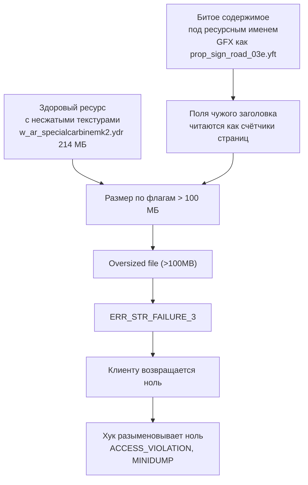

# Ворота перед записью в архив

`RpfEntryGate` - единственное место, которое решает, поедет ли байт-массив в RPF игры и в каком виде. Через него проходят все наши пути записи: доливка выбранных стволов в `miami_weapon.rpf`, правка целевого DLC, сборка ганпака в админке, оверлейные магазины. Ворота отвечают на два вопроса: не противоречит ли содержимое имени записи и влезет ли ресурс в стриминг.

Обе проверки закрывают один и тот же краш - `Oversized file (>100MB)` → `ERR_STR_FAILURE_3` → ноль → `ACCESS_VIOLATION`. Разница в том, что первую причину (битое содержимое под ресурсным именем) починить нельзя, а вторую (здоровый, но слишком жирный ресурс) - можно, и мы чиним: пережимаем текстуры, при необходимости уполовиниваем их, пока ган не влезет.

Порядок решений именно такой - сначала пробуем починить, отказ последнее средство. Выброшенная запись для игрока выглядит как «оружие пропало», и объяснять это нечем.

## Цепочка Oversized → ERR_STR_FAILURE_3 → вылет в ноль

GTA заносит **все** записи смонтированного архива в глобальный streaming index по имени, а тип ассета выбирает по расширению: `.yft` - fragment, `.ydr` - drawable, `.ytd` - словарь текстур. У ресурсных записей RSC7 размер в архиве **не хранится**, он вычисляется из полей заголовка `SystemFlags` / `GraphicsFlags` - упакованных счётчиков страниц.

Отсюда два пути к одной ошибке:



Первый путь мы разбирали на наполнителе чужого DLC-слота: под именем `prop_sign_road_03e.yft` лежал Scaleform-GFX, его заголовок разложился в абсурдный счётчик страниц, и игра падала при монтировании.

Второй путь массовый и куда неприятнее, потому что запись при этом **здоровая**. Замер кеша мастерской 22.08.2026:

| Файл | Размер в памяти игры | На диске |
|---|---|---|
| `w_sg_heavyshotgun.ydr` из каталога | 97 МБ | 5,2 МБ |
| `w_ar_specialcarbinemk2.ydr` из кеша мастерской | 214 МБ | - |

Ган на 214 МБ игра не примет никогда и упадёт ровно в тот момент, когда его текстуры поедут в стриминг. В логе игрока это видно по строке `Texture info:` с именами текстур этого ствола и следующим за ней MINIDUMP.

## Почему проверка стоит именно здесь

Изначально проверка содержимого жила в `ImprovementInstallService` - там, где мы чистим чужой DLC-слот. 21.08.2026 та же цепочка пришла в логах игроков уже на нашем ганпак-архиве: `Oversized file (>100MB) miami_weapon.rpf`. То есть проблема была не в чужих слотах, а в любом пути, которым байты попадают в архив, а таких путей у нас больше десятка.

Поэтому проверка переехала в отдельный статический класс без состояния, и каждый писатель зовёт одно и то же:

| Вызывающий | Что кладёт |
|---|---|
| `MiamiGraphics.Shell/Services/RpfFileMutator.cs` | доливка стволов в `miami_weapon.rpf` у игрока |
| `MiamiGraphics.Shell/Services/TargetDlcEditor.cs` | правки целевого DLC |
| `MiamiGraphics.Shell/Services/HunterGunsSelectedRpfBuilder.cs` | выбранные ганы и оверлейные магазины |
| `MiamiGraphics.Shell/Admin/AdminGunpackQueueService.cs` | сборка пака перед публикацией в каталог |

Последний случай отдельный: оттуда пак уезжает в каталог и в CDN, то есть на все машины сразу. Там мы ужимаем ган **на месте публикации**, иначе чинить его пришлось бы на каждой машине по отдельности - а те паки, что уже лежат у людей на дисках, задним числом никто не перезальёт.

Проверка содержимого стоит четыре байта на запись, поэтому применять её можно везде без оглядки на скорость.

## Что считается противоречием имени

`RpfEntrySanity.RejectReason` возвращает причину отказа или `null`. Порядок проверок:

```cs title="MiamiGraphics.Core/Services/RpfEntrySanity.cs"
public static string? RejectReason(string? name, byte[]? bytes)
{
    if (NameIsGarbage(name))
        return "непечатное имя (мусор обфускации)";

    if (NameSaysNestedRpf(name))
        return IsRpf7(bytes) ? null : $"вложенный rpf без заголовка RPF7 ({Magic(bytes)})";

    if (!NameSaysResource(name)) return null;

    if (!IsRsc7(bytes))
        return $"ресурсное имя, а содержимое не RSC7 ({Magic(bytes)})";

    return RpfResourceBudget.RejectReasonBySize(name, bytes);
}
```

Ресурсными считаются одиннадцать расширений: `.ydr`, `.yft`, `.ytd`, `.ymap`, `.ytyp`, `.ycd`, `.yld`, `.ypt`, `.ybn`, `.yed`, `.ynv`. Всё остальное (`.meta`, `.xml`, `.dat`, `.awc`) пропускаем не глядя - GTA читает такие записи как двоичные, и заголовок у них какой угодно.

Проверять содержимое ресурсной записи в обратную сторону не надо: у неё заголовок RSC7 достраивается из полей самой записи. Подделкой может быть только запись с ресурсным **именем** и не-ресурсным содержимым.

### Две магии, и они несимметричны

```cs title="MiamiGraphics.Core/Services/RpfEntrySanity.cs"
public static bool IsRsc7(byte[]? d) =>
    d is { Length: >= 4 } && d[0] == 0x52 && d[1] == 0x53 && d[2] == 0x43 && d[3] == 0x37;

public static bool IsRpf7(byte[]? d) =>
    d is { Length: >= 4 } && d[0] == 0x37 && d[1] == 0x46 && d[2] == 0x50 && d[3] == 0x52;
```

У ресурса байты лежат как есть - `52 53 43 37`, то есть читаемое `RSC7`. У архива идентификатор хранится как uint32 `0x52504637` в little-endian, поэтому **на диске** байты идут `37 46 50 52` - `7FPR`, а не `RPF7`. Сравнение с `'R','P','F','7'` не совпало бы никогда, и любой настоящий вложенный архив уезжал бы в «фейковые».

### Непечатное имя и не-ASCII - разные вещи

`NameIsGarbage` (пусто или символ < 32) отсекает записи, которые игра просто не умеет адресовать. `NameIsNonAscii` (символ > 126) в `RejectReason` **не входит** намеренно: за такими именами чужие моды прячут фейковые вложенные rpf, и при чистке чужого слота их надо выбрасывать, а на наших путях записи это слишком грубо - автор мода вполне мог назвать файл кириллицей, и молча потерять его хуже, чем донести до игры бесполезную запись.

## Бюджет ресурса: откуда берётся размер

Размер считается ровно так же, как его считает клиент - из двух полей заголовка, по 4 байта каждое, на смещениях 8 и 12:

```cs title="MiamiGraphics.Core/Services/RpfResourceBudget.cs"
public static bool TryReadFlags(byte[]? d, out uint sys, out uint gfx)
{
    sys = gfx = 0;
    if (!RpfEntrySanity.IsRsc7(d) || d!.Length < 16) return false;
    sys = BitConverter.ToUInt32(d, 8);
    gfx = BitConverter.ToUInt32(d, 12);
    return true;
}

public static long MemorySize(byte[]? d)
{
    if (!TryReadFlags(d, out var sys, out var gfx)) return 0;
    return (long)(uint)RpfResourceFileEntry.GetSizeFromFlags(sys)
         + (long)(uint)RpfResourceFileEntry.GetSizeFromFlags(gfx);
}
```

Каждый флаг - набор счётчиков страниц разного калибра плюс базовый сдвиг:

| Биты | Множитель | Максимум группы |
|---|---|---|
| 27 | ×1 | 1 |
| 26 | ×2 | 2 |
| 25 | ×4 | 4 |
| 24 | ×8 | 8 |
| 17-23 | ×16 | 127 × 16 |
| 11-16 | ×32 | 63 × 32 |
| 7-10 | ×64 | 15 × 64 |
| 5-6 | ×128 | 3 × 128 |
| 4 | ×256 | 256 |
| 0-3 | базовый размер страницы `0x200 << ss` | 512 Б … 16 МБ |

Размер = сумма всех групп × базовый размер страницы. Пример из тестов: флаг графики `0x50FE0007` - семибитная группа заполнена целиком (127), базовый сдвиг 7 даёт страницу 64 КБ, итого 127 × 16 × 64 КБ = 127 МБ одной только графики. Флаг системы `0xA0000012` при этом даёт 512 КБ. Ровно такая пропорция и приходила из кеша мастерской.

### Пороги

| Константа | Значение | Что делаем |
|---|---|---|
| `GameHardLimit` | 100 МБ (104 857 600 Б) | потолок клиента: выше - `Oversized file (>100MB)` |
| `RefuseAt` | 90 МБ (94 371 840 Б) | наш порог: выше - чиним, не вышло - отказ |
| `WarnAt` | 64 МБ (67 108 864 Б) | объявлен как «уже опасно»; отдельной строки в журнал пока не пишет, весь код смотрит на `RefuseAt` |

Отказываем на 90, а не на 100, намеренно: размер считается по страницам, у сборщика ресурса есть округление вверх, и упереться в ровно 100 МБ значит поймать падение на округлении.

### Два случая, когда бюджет молчит

- **Двоичная запись.** `MemorySize` вернёт 0 - у неё нет заголовка RSC7, а настоящий размер лежит в самой записи архива. Считать там нечего.
- **Короткий буфер.** Часть вызывающих даёт только первые четыре байта (проверка содержимого больше и не требует). При длине меньше 16 байт `TryReadFlags` отдаёт `false`, и проверка размера обязана молчать, а не выдумывать причину отказа. На это есть отдельный тест.

Строка отказа собирается с раскладкой по частям, чтобы по журналу было видно, текстуры это или геометрия:

```
ресурс на 214 МБ в памяти игры (система 6 + графика 208), потолок стриминга 100 МБ -
игра ответит «Oversized file (>100MB)» и упадёт
```

## Почему ганы вырастают до 200 МБ

Пока каждый писатель (мастерская, скины, наклейки, стекло, аним-детали) клал пиксели как есть - несжатый `D3DFMT_A8R8G8B8`, `Levels = 1`, в разрешении присланного PNG, - формат был рабочий: игра его читает. Платить приходилось памятью: 2048×2048 несжатой текстуры это 16 МБ против 4 МБ у BC3 и 2 МБ у BC1, а с мипами разница ещё больше. Каждая правка текстуры приближала ган к гарантированному крашу, а пара правок подряд (открыть опубликованный скин → поправить → опубликовать) уводила за потолок совсем.

Сейчас все писатели идут через `GameTextureWriter`, и он даёт два обещания: **сжимаем** и **не растим**.

```cs title="MiamiGraphics.Core/Services/GameTextureWriter.cs"
public static Policy PolicyFor(Texture tex)
{
    long px = (long)tex.Width * tex.Height;
    return tex.Format switch
    {
        TextureFormat.D3DFMT_DXT1 => Policy.Auto,
        TextureFormat.D3DFMT_A8R8G8B8 when px <= RawBelowPixels => Policy.KeepRaw,
        TextureFormat.D3DFMT_A8R8G8B8 => Policy.Auto,
        _ => Policy.ForceBc3,   // DXT3/DXT5/BC7/ATI - альфа и градиенты берегём
    };
}
```

| Что заменяем | Политика | Почему |
|---|---|---|
| `DXT1` | `Auto` - решаем по альфе | автор уже сжал, семейство сохраняем |
| `A8R8G8B8` ≤ 65 536 пикселей (256×256) | `KeepRaw` | 256 КБ сырых - экономить нечего, а блочные артефакты на мелкой маске видны |
| `A8R8G8B8` крупнее | `Auto` | ровно этот случай и раздувал ганы |
| `DXT3`/`DXT5`/`BC7`/`ATI` | `ForceBc3` | автор пака выбрал формат с альфой не случайно |

Остальные правила:

- потолок стороны берётся от **оригинала**, который заменяем; для текстур, созданных с нуля (наклейки, брелоки) - `MaxSide = 2048`;
- BC жмёт блоками 4×4, поэтому сторона, не кратная четырём, остаётся несжатой: обрезать её нельзя, уедут UV;
- мипы пишем полной цепочкой, но не больше 14 уровней: 256×256 даёт 9, 2048×64 даёт 12;
- при любой неудаче кодека честно откатываемся на прежний несжатый `A8R8G8B8` - испортить картинку хуже, чем не сжать;
- идентичность текстуры (`Name`, `NameHash`, `Usage`, `Unknown`-поля) не трогаем: меняются только размерность, формат, число уровней и данные.

## Как мы укладываем ресурс вместо отказа

`GunResourceFitter.Fit` умеет разбирать три расширения - `.ydr`, `.ytd`, `.yft`. Работает в два шага.

**Шаг 1 - пережать всё несжатое.** Самый дешёвый выигрыш: несжатая текстура вчетверо-ввосьмеро тяжелее той же в BC. Политику берём от самой текстуры, но `KeepRaw` здесь превращается в `Auto` - на этом пути мы ужимаем принудительно.

**Шаг 2 - половинить самые тяжёлые, пока не влезет.**

```cs title="MiamiGraphics.Core/Services/GunResourceFitter.cs"
long texSum = TexBytes(textures);
long nonTex = Math.Max(0, after - texSum);
var stuck = new HashSet<Texture>();
int downscaled = 0, steps = 0;

while (after > RpfResourceBudget.RefuseAt && steps < MaxSteps)
{
    var victim = textures
        .Where(t => !stuck.Contains(t) && t.Width > MinSide && t.Height > MinSide)
        .OrderByDescending(t => (long)(t.Data?.FullData?.Length ?? 0))
        .FirstOrDefault();
    if (victim == null) break;   // ужимать больше нечего

    steps++;
    if (!Recode(victim, Math.Max(MinSide, victim.Width / 2),
                        Math.Max(MinSide, victim.Height / 2)))
    {
        stuck.Add(victim);
        continue;
    }
    downscaled++;

    texSum = TexBytes(textures);
    if (nonTex + texSum > RpfResourceBudget.RefuseAt) continue;   // ещё не влезли по оценке

    current = doc.Save();
    after = RpfResourceBudget.MemorySize(current);
    nonTex = Math.Max(0, after - texSum);   // уточняем по факту
}
```

Три решения в этом цикле неочевидны:

- **Шагаем по оценке, а не по факту.** Пересобирать файл на каждое половинение стоит около полутора секунд на ган. Графические страницы - это почти целиком данные текстур, а геометрия и шейдеры от наших правок не меняются, поэтому «нетекстурную» часть считаем один раз и держим как константу. Пересобираем и сверяемся с настоящим размером только когда оценка говорит «влезли», и тут же уточняем константу по факту.
- **Формат без декодера не повод бросать весь ган.** В паках попадается BC7, у `DDSIO` декодера на него нет. Такая текстура уходит в `stuck`, и мы берём следующую по весу. Обходной путь на чтение пикселей всё же есть: собираем DDS и отдаём его ImageMagick, как в конвертере превью.
- **Нижняя граница и страховка.** `MinSide = 128` - ниже начинается мыло. `MaxSteps = 12` - страховка от вечного цикла.

Если разобрать ресурс не вышло (исключение в парсере), отдаём байты как были: решение «класть или нет» остаётся за воротами, и оно будет «нет».

Замеры на реальных файлах кеша мастерской, 22.08.2026:

| Файл | До | После | Что сделали |
|---|---|---|---|
| `w_ar_specialcarbinemk2.ydr` | 214,5 МБ | 86,5 МБ | пережато 4, уменьшено 1 |
| `w_ar_specialcarbinemk2.ydr` | 182,5 МБ | 74,5 МБ | пережато 3, уменьшено 3 |
| `w_ar_specialcarbinemk2.ydr` | 128,3 МБ | 8,3 МБ | пережато 1 |

Второй показателен: четыре текстуры 4096×4096 и три несжатые 2048×2048 - 141 МБ одних текстур при 6 МБ геометрии.

## Порядок решений в воротах

```cs title="MiamiGraphics.Core/Services/RpfEntryGate.cs"
public static bool TryPrepare(string? name, byte[]? bytes,
    out byte[] prepared, out string? reason, out string? note)
{
    prepared = bytes ?? Array.Empty<byte>();
    note = null;
    reason = RpfEntrySanity.RejectReason(name, bytes);
    if (reason == null) return true;

    // Чинить умеем только «слишком жирный ресурс».
    if (bytes == null || !RpfResourceBudget.IsOverBudget(bytes)) return false;

    var key = HashOf(bytes);
    if (_fitted.TryGetValue(key, out var cached))
    {
        prepared = cached;
        note = "ужат под стриминг (повтор того же файла)";
        reason = null;
        return true;
    }

    var fitted = GunResourceFitter.Fit(name!, bytes, out var rep);
    if (!rep.Fits) return false;
    ...
}
```

На выходе три значения: `prepared` - что класть (может отличаться от входа), `reason` - почему нельзя класть, `note` - что сделали, если чинили. Вызывающий пишет `reason` в журнал и пропускает запись, `note` пишет и кладёт.

Битое содержимое под ресурсным именем не лечится: там и разбирать нечего, поэтому проверка `IsOverBudget` стоит вторым условием - она отделяет «жирный, но здоровый» от «просто не тот файл».

### Кеш ужатых записей

Ключ - SHA-256 исходных байт, ёмкость - четыре записи, при переполнении чистим целиком.

Кеш нужен потому, что у модеров `w_x.ydr` и `w_x_hi.ydr` в паке байт-в-байт одинаковые, а ужимание тяжёлое - секунды на ган. Ёмкость маленькая потому, что в кеше лежат **готовые** файлы по 10-20 МБ: большой кеш здесь съел бы ровно ту память, которую мы экономим. Четырёх хватает - повторяется всегда ближайшая пара.

## Обратная связь: подпись краха в логах игрока

Чтобы понимать, работают ворота или нет, мы разбираем клиентские логи на старте лаунчера. `MajesticCrashLog.Parse` ищет маркер смерти `[hooks] MINIDUMP` и различает три подписи:

| Подпись | По чему определяем |
|---|---|
| стриминг: запись не влезла | строка `Oversized file (>100MB)` (регулярка забирает и имя архива) или `ERR_STR_FAILURE` |
| сборка педов на спавне | ≥ 200 строк `Failed to request model` |
| неизвестная | ни того, ни другого |

Счётчик `Failed to request model` оказался лучшим разделителем: в разобранных логах у падений 1399 / 1170 / 571 / 233, а у единственной выжившей 44-минутной сессии - 171.

`Oversized` без минидампа - тоже находка: игра выжила, но ассет не загрузился, и в следующий раз может не повезти. Такой лог мы всё равно записываем в журнал вместе со списком того, что у человека из наших модов стояло на тот момент.

## Тесты

- `RpfEntryGateTests` собирает настоящий `.ytd` через CodeWalker - восемь несжатых текстур 2048×2048, 128 МБ данных - и проверяет, что после ворот он влезает в `RefuseAt`. Тест намеренно работает на живом сохранении, а не на моках: размер считает игра, по флагам страниц.
- `RpfResourceBudgetTests` собирает шапку RSC7 вручную и проверяет разбор флагов, отказ жирному ресурсу, молчание на коротком буфере и ноль для двоичной записи.
- `GameTextureWriterTests` держит оба обещания писателя: DXT1 без альфы, DXT5 с альфой, замена не больше оригинала, потолок 2048 для созданных с нуля, некратная четырём сторона остаётся сырой.

## Чего ворота не делают

- **Не спасают от краша по другой причине.** Ресурс на 80 МБ пройдёт, даже если игра упадёт на нём по своим соображениям.
- **Не проверяют двоичные записи по размеру.** У них нет заголовка RSC7, считать нечего.
- **Не режут не-ASCII имена на наших путях записи.** Это делается только при чистке чужого DLC-слота.
- **Не чинят то, что не разобрать.** Ресурс с расширением вне `.ydr`/`.ytd`/`.yft`, битый парсером или состоящий из текстур без декодера, уедет в отказ - с причиной в журнале.

Смежное: [обзор RPF8](../rpf/index.md), [структура архива](../rpf/archive-structure.md), [Smart Rebuild](../inject/smart-rebuild.md), [гарды перед инжектом](../protection/guards.md).
